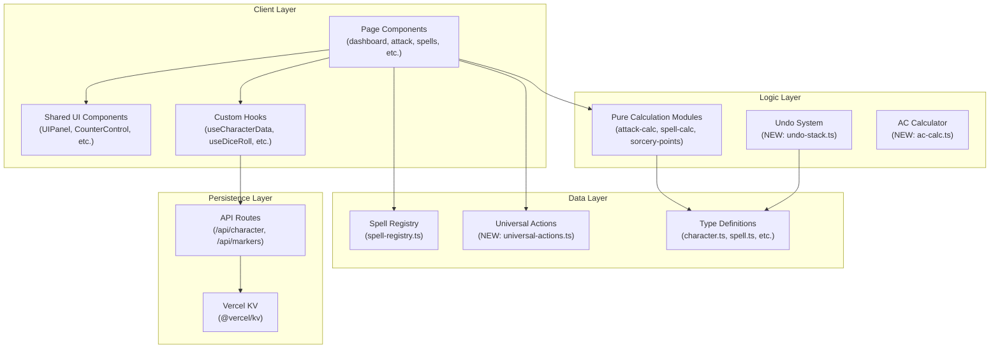

# Design Document: D&D Tracker Enhancements

## Overview

This design covers 16 enhancements to the D&D Character Tracker Next.js application. The changes span data model extensions, new UI components, pure logic modules, and improvements to existing pages. All enhancements follow the established patterns: client-side React components using `useCharacterData` for state, `useAutoSave` for debounced persistence to Vercel KV, pure calculation modules for testable logic, and the existing `useDiceRoll` hook for 3D dice rolling.

The enhancements are grouped into four categories:

1. **Data model extensions** — new fields on `CharacterData`, `SpellData`, `Weapon`, and inventory item types (Requirements 1, 2, 6, 8, 9, 10, 11, 14)
2. **New pure logic modules** — undo system, AC calculation engine, hit dice management, treasure valuation (Requirements 4, 6, 7, 8, 10, 11)
3. **New/updated UI components** — death save tracker improvements, universal actions, weapon cards, bag item cards, dashboard layout (Requirements 2, 3, 5, 9, 13, 15, 16)
4. **Map improvements** — zoom/pan configuration, Aetherion marker support (Requirement 12)

## Architecture

The application follows a clear layered architecture that this design preserves:



### Key Design Decisions

1. **Extend existing types rather than create parallel ones.** New fields are added as optional properties on `CharacterData` to maintain backward compatibility with existing KV data.
2. **Pure logic modules for all testable calculations.** AC computation, hit dice management, undo snapshots, treasure totals, and gear stat effects are implemented as pure functions separate from React components.
3. **Client-side undo stack.** The undo system lives entirely in a React hook (`useUndoStack`) that wraps `useCharacterData.mutate`. No server-side undo history — snapshots are in-memory only and cleared on navigation.
4. **Inventory items become structured objects.** The current `string[]` inventory model is replaced with typed item objects (`GearItem`, `UtilityItem`, `TreasureItem`) to support quantity, equipped/attuned state, stat modifiers, and estimated values.

## Components and Interfaces

### New Pure Logic Modules

#### `src/src/lib/undo-stack.ts`

Manages the undo snapshot stack. Pure functions, no React dependency.

```typescript
interface UndoSnapshot {
  timestamp: number;
  fields: Partial<CharacterData>;
}

function pushSnapshot(stack: UndoSnapshot[], snapshot: UndoSnapshot, maxSize?: number): UndoSnapshot[];
function popSnapshot(stack: UndoSnapshot[]): { snapshot: UndoSnapshot | null; remaining: UndoSnapshot[] };
function captureSnapshot(data: CharacterData, changedKeys: (keyof CharacterData)[]): UndoSnapshot;
```

#### `src/src/hooks/useUndoStack.ts`

React hook that wraps `useCharacterData.mutate` to capture snapshots before mutations and handle Ctrl+Z / Cmd+Z keyboard events. Maintains a stack of up to 20 snapshots. Clears on route change via `usePathname()`.

```typescript
function useUndoStack(data: CharacterData | null, mutate: (partial: Partial<CharacterData>) => void): {
  undoableMutate: (partial: Partial<CharacterData>) => void;
  undo: () => void;
  canUndo: boolean;
};
```

#### `src/src/lib/ac-calc.ts`

Pure AC calculation that computes final AC from base AC, shield toggle, mage armor toggle, bladesong, and gear stat modifiers.

```typescript
interface ACInputs {
  defaultBaseAc: number;
  dexModifier: number;
  mageArmorActive: boolean;
  shieldActive: boolean;
  bladesongActive: boolean;
  intModifier: number;
  gearAcBonuses: number[];  // from equipped gear stat modifiers
}

function calculateAC(inputs: ACInputs): { ac: number; baseAc: number };
```

#### `src/src/lib/hit-dice.ts`

Pure hit dice pool management for multiclass characters.

```typescript
interface HitDicePool {
  className: string;
  dieSize: number;   // 6, 8, 10, 12
  total: number;
  available: number;
}

function spendHitDie(pools: HitDicePool[], className: string): HitDicePool[] | null;
function longRestRestore(pools: HitDicePool[]): HitDicePool[];
```

#### `src/src/lib/treasure-calc.ts`

Pure treasure value calculation.

```typescript
function totalTreasureValue(items: TreasureItem[]): number;
```

#### `src/src/lib/gear-stats.ts`

Pure gear stat modifier aggregation.

```typescript
interface StatModifier {
  stat: string;   // "ac", "attack", "damage", etc.
  value: number;
}

function aggregateGearModifiers(items: GearItem[]): StatModifier[];
function getEquippedAcBonus(items: GearItem[]): number;
```

### New Data Modules

#### `src/src/data/universal-actions.ts`

Static data for the 10 universal D&D combat actions. Each entry has a name and full D&D 2024 rules description.

```typescript
interface UniversalAction {
  name: string;
  description: string;
}

const UNIVERSAL_ACTIONS: UniversalAction[];
```

### Updated UI Components

#### `src/src/components/dashboard/DeathSaveTracker.tsx` (updated)

Already exists and handles death save rolling. Requirement 2 is largely satisfied by the existing implementation. The component already shows 3 success/3 failure slots, handles nat 20/nat 1, and persists via `mutate`. A reset button will be added.

#### `src/src/components/ui/CounterControl.tsx` (unchanged)

Already supports min/max capping. Used for inspiration (max changes from 10 to 2 per Req 7) and luck points.

#### `src/src/components/attack/WeaponCard.tsx` (new)

Redesigned weapon card component showing full weapon details, properties, masteries, damage dice, damage type, magic bonus, and attack/damage roll buttons with advantage/disadvantage toggles.

#### `src/src/components/bag/BagItemCard.tsx` (new)

Expandable item card for inventory items showing quantity, description, and category-specific details (equipped/attuned for gear, estimated value for treasure).

#### `src/src/components/bag/GearItemCard.tsx` (new)

Extends BagItemCard with equipped/attuned toggle buttons and stat modifier display.

#### `src/src/components/bag/TreasureItemCard.tsx` (new)

Extends BagItemCard with estimated gold value display and edit capability.

### Updated Pages

All pages continue to use the existing pattern: `useCharacterData()` for data, `useDiceRoll()` for dice, `ScreenBackground` + `AmbientEffects` + `NavButtons` for layout.

#### Dashboard Page Changes (Req 5, 7, 8, 16)
- Luck counter conditionally rendered based on `featsTraits.includes("Lucky")`
- Inspiration max changed from 10 to 2
- Shield/Mage Armor buttons reduced in size (smaller padding/font)
- AC displayed in a larger, more prominent element
- HP bar centered horizontally
- Passive Perception displayed (10 + WIS perception modifier)
- Initiative roll button added (d20 + DEX modifier)
- Long rest updated to cap inspiration at 2

#### Attack Page Changes (Req 14, 15)
- Weapon cards redesigned with full details (description, properties, masteries, damage type)
- Spell-created weapons rendered with distinct visual treatment (glowing border)
- Advantage/disadvantage toggles moved into each weapon card

#### Spells Page Changes (Req 1)
- `SpellCard` updated to display `upcastDescription` field when expanded
- Spell registry entries updated with `upcastDescription` text

#### Saves Page Changes (Req 2)
- Death save tracker already exists on dashboard at 0 HP; no saves page changes needed beyond what's already implemented

#### Actions Page Changes (Req 3, 13)
- Universal Actions section added below class-specific actions
- Expandable action cards for each universal action
- Second Wind already implemented; no changes needed

#### Bag Page Changes (Req 9, 10, 11)
- Inventory model migrated from `string[]` to structured item arrays
- Gear items show equipped/attuned indicators with toggle buttons
- Treasure items show estimated gold value with total sum
- All items show quantity and expand into detail cards

#### Map Page Changes (Req 12)
- `TransformWrapper` config updated: `minScale=1`, `maxScale=5`, smooth transitions enabled
- Pan boundaries clamped via `limitToBounds` prop
- Zoom/pan reset on map tab switch (already partially implemented)
- Aetherion maps already support markers (existing implementation handles both maps)

## Data Models

### Type Extensions to `CharacterData` (`src/src/types/character.ts`)

```typescript
// New/modified fields on CharacterData:

// Replace flat hitDice fields with multiclass pools
hitDicePools: HitDicePool[];
// Keep hitDiceTotal, hitDiceAvailable, hitDiceSize for backward compat (deprecated)

// Structured inventory replacing string arrays
inventoryItems: {
  gear: GearItem[];
  utility: UtilityItem[];
  treasure: TreasureItem[];
};
// Keep inventory: { gear: string[], utility: string[], treasure: string[] } for backward compat

// Spell-created temporary weapons
spellCreatedWeapons: SpellCreatedWeapon[];
```

### New Types

```typescript
// Hit dice pool for multiclass support
interface HitDicePool {
  className: string;
  dieSize: number;
  total: number;
  available: number;
}

// Structured inventory items
interface InventoryItemBase {
  id: string;
  name: string;
  description: string;
  quantity: number;
}

interface GearItem extends InventoryItemBase {
  equipped: boolean;
  requiresAttunement: boolean;
  attuned: boolean;
  statModifiers: StatModifier[];
}

interface StatModifier {
  stat: string;   // "ac", "attack", "damage"
  value: number;
}

interface UtilityItem extends InventoryItemBase {}

interface TreasureItem extends InventoryItemBase {
  estimatedValue: number;  // in gold pieces
}

// Spell-created weapon (temporary)
interface SpellCreatedWeapon {
  id: string;
  name: string;
  sourceSpell: string;
  castLevel: number;
  damageDice: string;
  damageType: string;
  attackStat: AbilityName;
  properties: string[];
  magicBonus: number;
  active: boolean;
}
```

### SpellData Extension (`src/src/types/spell.ts`)

```typescript
// Add to SpellData interface:
upcastDescription?: string;  // Human-readable upcasting text

// Add to SpellData interface for spell-created weapons:
createsWeapon?: {
  name: string;
  damageDice: string;
  damageType: string;
  attackStat: AbilityName;
  properties: string[];
  upcastDice?: string;  // additional dice per upcast level
};
```

### Universal Action Type (`src/src/data/universal-actions.ts`)

```typescript
interface UniversalAction {
  name: string;
  description: string;
}
```

### Data Migration

A migration function in `src/scripts/migrate.ts` will handle converting existing KV data:
- `inventory.gear: string[]` → `inventoryItems.gear: GearItem[]` (each string becomes a GearItem with quantity 1, not equipped, no attunement)
- `hitDiceTotal/hitDiceAvailable/hitDiceSize` → `hitDicePools` array (single pool for Madea, two pools for Ramil)
- Existing `deathSaves`, `shieldActive`, `mageArmorActive` fields are already present and compatible


## Correctness Properties

*A property is a characteristic or behavior that should hold true across all valid executions of a system — essentially, a formal statement about what the system should do. Properties serve as the bridge between human-readable specifications and machine-verifiable correctness guarantees.*

### Property 1: Spell registry upcast description consistency

*For any* spell in the SPELL_REGISTRY, the spell has an `upcastDescription` field if and only if it has an `upcast` field. Spells without `upcast` must not have `upcastDescription`, and spells with `upcast` must have a non-empty `upcastDescription`.

**Validates: Requirements 1.1, 1.3, 1.4**

### Property 2: Death save state bounds

*For any* death save state with successes in [0, 3] and failures in [0, 3], incrementing successes should produce a value clamped to [0, 3], and incrementing failures should produce a value clamped to [0, 3]. The state `{successes, failures}` must always satisfy `0 <= successes <= 3` and `0 <= failures <= 3`.

**Validates: Requirements 2.2, 2.3**

### Property 3: Death save state round-trip serialization

*For any* valid death save state `{successes: 0-3, failures: 0-3}`, serializing to JSON and deserializing back should produce an equivalent death save state.

**Validates: Requirements 2.8**

### Property 4: Undo round-trip

*For any* valid `CharacterData` state S and any partial mutation P, applying P to S to produce S', then undoing, should restore the original state S for the fields that were changed by P.

**Validates: Requirements 4.2, 4.6**

### Property 5: Undo stack size cap

*For any* sequence of N mutations where N > 20, the undo stack size should never exceed 20. The oldest snapshots are discarded when the cap is reached.

**Validates: Requirements 4.3**

### Property 6: Luck points visibility matches feat presence

*For any* character data, the Luck_Points counter should be visible if and only if the character's `featsTraits` array includes the string `"Lucky"`.

**Validates: Requirements 5.1, 5.2**

### Property 7: Hit dice pool spend correctness

*For any* set of hit dice pools and any valid class name, spending a hit die from that class should decrement only that pool's `available` count by 1, leaving all other pools unchanged. Spending should fail if the target pool has 0 available dice.

**Validates: Requirements 6.1, 6.3**

### Property 8: Hit dice long rest restoration

*For any* set of hit dice pools, long rest restoration should restore `floor(totalAcrossAllPools / 2)` dice (minimum 1), distributed across pools proportionally, and no pool's `available` should exceed its `total`.

**Validates: Requirements 6.5**

### Property 9: Inspiration counter bounds

*For any* inspiration value in [0, 2], incrementing should produce `min(value + 1, 2)` and decrementing should produce `max(value - 1, 0)`. The inspiration value must always satisfy `0 <= inspiration <= 2`.

**Validates: Requirements 7.1, 7.2, 7.3**

### Property 10: AC toggle round-trip

*For any* character state, toggling Shield on then off should return AC to its pre-toggle value. Similarly, toggling Mage Armor on then off should return both `baseAc` and `ac` to their pre-toggle values. The `calculateAC` function should be deterministic: the same inputs always produce the same output.

**Validates: Requirements 8.1, 8.2, 8.3, 8.4**

### Property 11: Inventory item quantity default and deduplication

*For any* inventory item added without an explicit quantity, the quantity should default to 1. *For any* inventory and any item name that already exists in that inventory, adding the same item should increment the existing item's quantity by 1 rather than creating a duplicate entry, and the total number of distinct items should remain unchanged.

**Validates: Requirements 9.4, 9.5**

### Property 12: Gear equip/unequip stat modifier round-trip

*For any* gear item with stat modifiers, equipping the item and then unequipping it should return the character's stats to their original values. The `aggregateGearModifiers` function applied to equipped items should equal the sum of individual item modifiers.

**Validates: Requirements 10.3, 10.4**

### Property 13: Treasure total value calculation

*For any* list of treasure items with non-negative `estimatedValue` fields, the `totalTreasureValue` function should return the exact sum of all `estimatedValue` fields. Adding or removing an item should change the total by exactly that item's value.

**Validates: Requirements 11.2, 11.4**

### Property 14: Action use decrement and short rest recharge

*For any* action with `uses > 0`, activating it should decrement `uses` by exactly 1. *For any* action with `recharge === "short_rest"`, a short rest should restore `uses` to `maxUses`.

**Validates: Requirements 13.2, 13.4**

### Property 15: Spell-created weapon upcast damage scaling

*For any* spell with a `createsWeapon` field and any valid cast level >= the spell's base level, the created weapon's damage dice should equal the base damage dice plus `(castLevel - baseLevel) * upcastDice` additional dice.

**Validates: Requirements 14.2**

### Property 16: Spell-created weapon create/dismiss round-trip

*For any* spell-created weapon added to the `spellCreatedWeapons` array, dismissing that weapon by ID should remove it from the array, and the array length should decrease by exactly 1.

**Validates: Requirements 14.1, 14.3**

### Property 17: Passive perception calculation

*For any* character data with a Wisdom score and a Perception skill entry, passive perception should equal `10 + perceptionSkill.modifier`. This must hold regardless of the character's other stats or proficiencies.

**Validates: Requirements 16.1, 16.6**

## Error Handling

### Client-Side Errors

| Scenario | Handling |
|---|---|
| Undo on empty stack | No-op, `canUndo` returns false |
| Spend hit die from empty pool | Return `null` from `spendHitDie`, UI shows pool as disabled |
| Increment inspiration beyond cap | `CounterControl` max prop prevents increment, button disabled |
| Increment death saves beyond 3 | `Math.min(3, value)` clamp in handler |
| Add item with empty name | Trim and reject empty strings (existing pattern) |
| Equip gear without attunement when attunement required | Show warning, prevent equip |
| Dismiss non-existent spell weapon | Filter is a no-op, no error |
| Invalid dice expression in spell registry | `parseDiceExpression` returns null, damage button hidden |

### API Errors

| Scenario | Handling |
|---|---|
| Auto-save fails | `console.error` in `useAutoSave`, retry on next mutation (existing behavior) |
| Character data not found | 404 response, loading state shows error message |
| Unauthorized request | 401 response, redirect to login (existing middleware) |
| KV connection failure | 500 response, error state in `useCharacterData` |

### Data Migration Errors

| Scenario | Handling |
|---|---|
| Missing inventory field | Default to empty arrays `{ gear: [], utility: [], treasure: [] }` |
| Missing hitDicePools | Fall back to legacy `hitDiceTotal/hitDiceAvailable/hitDiceSize` fields |
| Missing spellCreatedWeapons | Default to empty array `[]` |

## Testing Strategy

### Dual Testing Approach

This feature uses both unit tests and property-based tests for comprehensive coverage:

- **Property-based tests** (using `fast-check`): Verify universal properties across randomly generated inputs. Each property test runs a minimum of 100 iterations and references its design document property.
- **Unit tests** (using `vitest`): Verify specific examples, edge cases, UI rendering, and integration points.

### Property-Based Testing Configuration

- Library: `fast-check` (already in devDependencies)
- Framework: `vitest` (already configured)
- Minimum iterations: 100 per property test (`{ numRuns: 100 }`)
- Each test tagged with: `Feature: dnd-tracker-enhancements, Property {N}: {title}`
- Each correctness property is implemented by a single property-based test

### Test File Organization

| Property | Test File | Module Under Test |
|---|---|---|
| Property 1: Spell registry upcast consistency | `src/src/data/__tests__/spell-registry-upcast.property.test.ts` | `spell-registry.ts` |
| Property 2: Death save bounds | `src/src/types/__tests__/death-saves.property.test.ts` | Pure death save logic |
| Property 3: Death save round-trip | `src/src/types/__tests__/death-saves.property.test.ts` | JSON serialization |
| Property 4: Undo round-trip | `src/src/lib/__tests__/undo-stack.property.test.ts` | `undo-stack.ts` |
| Property 5: Undo stack cap | `src/src/lib/__tests__/undo-stack.property.test.ts` | `undo-stack.ts` |
| Property 6: Luck visibility | `src/src/components/dashboard/__tests__/luck-visibility.property.test.ts` | Pure logic check |
| Property 7: Hit dice spend | `src/src/lib/__tests__/hit-dice.property.test.ts` | `hit-dice.ts` |
| Property 8: Hit dice long rest | `src/src/lib/__tests__/hit-dice.property.test.ts` | `hit-dice.ts` |
| Property 9: Inspiration bounds | `src/src/components/ui/__tests__/counter-bounds.property.test.ts` | Pure bounds logic |
| Property 10: AC toggle round-trip | `src/src/lib/__tests__/ac-calc.property.test.ts` | `ac-calc.ts` |
| Property 11: Inventory deduplication | `src/src/lib/__tests__/inventory.property.test.ts` | Inventory logic |
| Property 12: Gear stat round-trip | `src/src/lib/__tests__/gear-stats.property.test.ts` | `gear-stats.ts` |
| Property 13: Treasure total | `src/src/lib/__tests__/treasure-calc.property.test.ts` | `treasure-calc.ts` |
| Property 14: Action use/recharge | `src/src/lib/__tests__/action-uses.property.test.ts` | Pure action logic |
| Property 15: Spell weapon upcast | `src/src/lib/__tests__/spell-weapon.property.test.ts` | Spell weapon creation logic |
| Property 16: Spell weapon round-trip | `src/src/lib/__tests__/spell-weapon.property.test.ts` | Spell weapon create/dismiss |
| Property 17: Passive perception | `src/src/lib/__tests__/passive-perception.property.test.ts` | Pure calculation |

### Unit Test Coverage

Unit tests focus on:
- UI component rendering (DeathSaveTracker shows 3+3 slots, WeaponCard shows all fields)
- Specific examples (Ramil has 1d10 + 4d6 hit dice, universal actions list has exactly 10 entries)
- Edge cases (undo on empty stack, spend from empty hit dice pool, zero-quantity items)
- Integration points (SpellCard displays upcastDescription, BagItemCard expand/collapse toggle)
