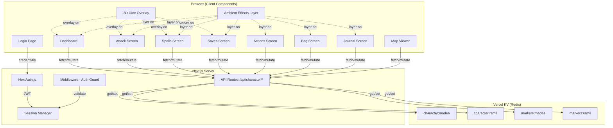

# Design Document: D&D Web Tracker

## Overview

This design describes the architecture for porting two existing pygame-based D&D 5E character trackers (Madea Blackthorn — Shadow Sorcerer 5, and Ramil al-Sayif — Fighter 1 / Wizard 4 Bladesinger) into a unified Next.js 14 web application. The app preserves the dark fantasy aesthetic, all gameplay mechanics, and existing campaign data while adding 3D dice rolling, interactive maps, and multi-device access via Vercel deployment.

The system is a two-user application with hardcoded credentials. Each authenticated user sees only their own character data. The app is organized as a screen-based SPA mirroring the original pygame navigation: Dashboard → Attack, Spells, Saves, Actions, Bag, Journal, Map.

### Key Design Decisions

1. **Next.js App Router with hybrid rendering**: Server components for layout/auth, client components for interactive screens (dice, maps, forms). This minimizes JS bundle while keeping the rich interactivity needed for gameplay.
2. **Vercel KV (Redis)**: Simple key-value store keyed by character ID (`madea`, `ramil`). Character data is a single JSON blob per character — matching the existing monolithic JSON approach. No relational DB needed for 2 users.
3. **Unified codebase with conditional rendering**: Instead of per-character code forks, class-specific features (sorcery points, bladesong, spell preparation) are conditionally rendered based on `characterClass` field in the data model.
4. **3D dice as lazy-loaded overlay**: The Three.js dice roller is a portal-based overlay that mounts on demand, avoiding the heavy 3D dependency on initial page load.
5. **Static image assets served from `/public`**: All existing PNG backgrounds and UI textures are copied into `/public/images/{character}/` and `/public/images/shared/` and served via Next.js Image optimization.

## Architecture



### Route Structure

```
/                       → Redirect to /dashboard or /login
/login                  → Login page (public)
/dashboard              → Character dashboard (main screen)
/attack                 → Attack rolls and weapon management
/spells                 → Spell management, slots, sorcery points / preparation
/saves                  → Saving throws
/actions                → Class actions and resources
/bag                    → Inventory and coins
/journal                → Session notes, NPCs, places
/map                    → Interactive map viewer
/api/auth/[...nextauth] → NextAuth endpoints
/api/character/get      → GET character data
/api/character/update   → POST partial character update
/api/markers/get        → GET map markers
/api/markers/update     → POST map marker changes
```

### Middleware

A single `middleware.ts` at the project root intercepts all requests. Unauthenticated users are redirected to `/login`. The `/login` route and `/api/auth/*` routes are excluded from the guard.

## Components and Interfaces

### Component Hierarchy

```mermaid
graph TD
    RootLayout[RootLayout - Server Component]
    RootLayout --> AuthProvider[SessionProvider]
    AuthProvider --> PageTransition[PageTransition - Framer Motion AnimatePresence]

    PageTransition --> LoginPage[LoginPage]
    PageTransition --> DashboardPage[DashboardPage]
    PageTransition --> AttackPage[AttackPage]
    PageTransition --> SpellsPage[SpellsPage]
    PageTransition --> SavesPage[SavesPage]
    PageTransition --> ActionsPage[ActionsPage]
    PageTransition --> BagPage[BagPage]
    PageTransition --> JournalPage[JournalPage]
    PageTransition --> MapPage[MapPage]

    DashboardPage --> ScreenBackground[ScreenBackground]
    DashboardPage --> CharacterHeader[CharacterHeader]
    DashboardPage --> HealthDisplay[HealthDisplay]
    DashboardPage --> StatsGrid[AbilityScoresGrid]
    DashboardPage --> SkillsList[SkillsList]
    DashboardPage --> FeatsList[FeatsList]
    DashboardPage --> NavButtons[NavButtons]
    DashboardPage --> DeathSaveTracker[DeathSaveTracker]
    DashboardPage --> AmbientEffects[AmbientEffects]

    HealthDisplay --> HpBar[HpBar]
    HealthDisplay --> DamageHealInput[DamageHealInput]
    HealthDisplay --> ShieldToggle[ShieldToggle]
    HealthDisplay --> MageArmorToggle[MageArmorToggle]
    HealthDisplay --> InspirationCounter[InspirationCounter]
    HealthDisplay --> LuckCounter[LuckCounter]

    SpellsPage --> SpellSlotTracker[SpellSlotTracker]
    SpellsPage --> SpellList[SpellList]
    SpellsPage --> SorceryPointPanel[SorceryPointPanel - Madea only]
    SpellsPage --> SpellPrepPanel[SpellPrepPanel - Ramil only]

    ActionsPage --> ActionCard[ActionCard]
    ActionsPage --> BladesongTracker[BladesongTracker - Ramil only]
    ActionsPage --> RavenFormTracker[RavenFormTracker - Madea only]

    MapPage --> MapViewer[MapViewer - react-zoom-pan-pinch]
    MapPage --> MarkerLayer[MarkerLayer]
    MapPage --> MarkerForm[MarkerForm]
    MapPage --> FloorSelector[FloorSelector]
    MapPage --> CategoryFilter[CategoryFilter]

    RootLayout --> DiceOverlay[DiceOverlay - lazy loaded portal]
    DiceOverlay --> DiceScene[DiceScene - @react-three/fiber]
    DiceOverlay --> DiceResult[DiceResult]
```



### Core Shared Components

| Component | Props | Description |
|---|---|---|
| `ScreenBackground` | `screen: string, characterId: string` | Renders full-screen background PNG for the given screen |
| `UIPanel` | `variant: 'box' \| 'box1' \| 'box2' \| 'box4' \| 'dark' \| 'fancy', children` | Card/panel with UI texture background image |
| `NavButtons` | `currentScreen: string` | Navigation bar with buttons for all screens |
| `DiceOverlay` | `roll: DiceRoll \| null, onComplete: (result) => void` | Lazy-loaded 3D dice overlay portal |
| `AmbientEffects` | `screen: string` | Framer Motion ambient effects (firepit glow on dashboard, light rays on submenus) |
| `PageTransition` | `children` | AnimatePresence wrapper for route transitions |
| `CounterControl` | `value: number, min: number, max: number, onChange: (n) => void` | Increment/decrement control for inspiration, luck, etc. |
| `RestModal` | `type: 'short' \| 'long', characterData, onConfirm, onCancel` | Modal for rest mechanics with hit die selection |

### Screen-Specific Components

| Component | Screen | Description |
|---|---|---|
| `CharacterHeader` | Dashboard | Name, race, class, level display |
| `HealthDisplay` | Dashboard | HP bar, damage/heal input, AC, shield/mage armor toggles |
| `AbilityScoresGrid` | Dashboard | 6 ability scores with click-to-roll |
| `SkillsList` | Dashboard | 18 skills with proficiency indicators, click-to-roll |
| `FeatsList` | Dashboard | Feats and traits list |
| `DeathSaveTracker` | Dashboard | 3 success / 3 failure slots, visible at 0 HP |
| `WeaponCard` | Attack | Weapon display with attack/damage roll triggers |
| `AdvantageToggle` | Attack, Saves | Advantage/disadvantage selector |
| `SpellSlotTracker` | Spells | Current/max slots per level with cast buttons |
| `SpellList` | Spells | Cantrips and leveled spells with detail view |
| `SorceryPointPanel` | Spells | SP display, convert SP↔slots (Madea only) |
| `SpellPrepPanel` | Spells | Prepared spell toggles, count display (Ramil only) |
| `ActionCard` | Actions | Action with uses, description, activate button |
| `BladesongTracker` | Actions | Bladesong uses and active toggle (Ramil only) |
| `RavenFormTracker` | Actions | Raven form uses and toggle (Madea only) |
| `InventorySection` | Bag | Gear/utility/treasure lists with add/remove |
| `CoinTracker` | Bag | 5 denomination coin display with edit |
| `SessionList` | Journal | Session entries with create/rename |
| `SessionEditor` | Journal | Freeform text editor for session notes |
| `EntityTracker` | Journal | NPC and Place tracking with CRUD |
| `MapViewer` | Map | Pan/zoom map with react-zoom-pan-pinch |
| `MarkerLayer` | Map | Renders category-icon markers on map |
| `MarkerForm` | Map | Create/edit marker popup |
| `FloorSelector` | Map | Aetherion floor selector (Ground–4th) |
| `CategoryFilter` | Map | Toggle visibility per marker category |

### Custom Hooks

| Hook | Purpose |
|---|---|
| `useCharacterData()` | Fetches and caches character data, provides `mutate` for optimistic updates |
| `useDiceRoll()` | Manages dice roll state, triggers overlay, returns result via callback |
| `useMapMarkers()` | Fetches and mutates per-character map markers |
| `useAutoSave(data, delay)` | Debounced auto-persist to API after state changes |

### API Route Handlers

All API routes validate the session and extract `characterId` from the JWT.

```typescript
// GET /api/character/get
// Returns: CharacterData for the authenticated user

// POST /api/character/update
// Body: Partial<CharacterData>
// Merges partial update into stored character data, returns updated data

// GET /api/markers/get
// Query: ?map=valerion|aetherion&floor=0|1|2|3|4
// Returns: MapMarker[] for the authenticated user

// POST /api/markers/update
// Body: { action: 'create' | 'update' | 'delete', marker: MapMarker }
// Returns: updated MapMarker[]
```

## Data Models

### CharacterData (TypeScript Interface)

```typescript
interface CharacterData {
  // Identity
  characterName: string;
  race: string;
  charClass: string;       // e.g. "Sorcerer 5" or "Fighter 1 / Wizard 4 (Bladesinger)"
  level: number;

  // Health
  currentHp: number;
  maxHp: number;
  ac: number;
  baseAc: number;
  defaultBaseAc: number;

  // Resources
  inspiration: number;     // 0–10
  luckPoints: number;      // 0–3

  // Toggles
  shieldActive: boolean;
  mageArmorActive: boolean;

  // Hit Dice
  hitDiceTotal: number;
  hitDiceAvailable: number;
  hitDiceSize: number;     // 6 for Sorcerer/Wizard, 10 for Fighter

  // Ability Scores
  proficiencyBonus: number;
  stats: Record<AbilityName, { value: number; modifier: number }>;

  // Skills
  skills: Skill[];

  // Feats
  featsTraits: string[];

  // Spells
  spellSlots: Record<string, number>;         // max slots per level
  currentSpellSlots: Record<string, number>;   // current slots per level
  createdSpellSlots: Record<string, number>;   // SP-converted slots
  cantrips: string[];
  spells: Record<string, string[]>;            // spells by level key

  // Weapons
  weapons: Weapon[];
  fightingStyles: Record<string, boolean>;

  // Saves
  saveProficiencies: AbilityName[];
  deathSaves: { successes: number; failures: number };

  // Actions
  actions: Record<string, Action>;

  // Inventory
  inventory: {
    gear: string[];
    utility: string[];
    treasure: string[];
  };
  coins: { cp: number; sp: number; ep: number; gp: number; pp: number };

  // Journal
  journal: {
    sessions: Record<string, string>;
    currentSession: string;
  };
  characters: Record<string, string>;   // NPC name → description
  places: Record<string, string>;       // Place name → description

  // Class-specific resources (unified object)
  classResources: ClassResources;
}

type AbilityName = 'STR' | 'DEX' | 'CON' | 'INT' | 'WIS' | 'CHA';

interface Skill {
  name: string;
  stat: AbilityName;
  proficient: boolean;
  modifier: number;
}

interface Weapon {
  name: string;
  damageDice: string;
  damageType: string;
  attackStat: AbilityName;
  properties: string[];
  magicBonus: number;
  usesDueling: boolean;
  twoHanded: boolean;
}

interface Action {
  name: string;
  description: string;
  available: boolean;
  recharge: 'short_rest' | 'long_rest';
  uses: number;
  maxUses: number;
  dice?: string;
  bonus?: number;
}

interface ClassResources {
  // Sorcerer (Madea)
  sorceryPointsMax?: number;
  currentSorceryPoints?: number;
  ravenFormActive?: boolean;
  ravenFormUsesRemaining?: number;
  ravenFormMaxUses?: number;
  sorcerousRestorationUsed?: boolean;

  // Wizard/Bladesinger (Ramil)
  bladesongActive?: boolean;
  bladesongUsesRemaining?: number;
  bladesongMaxUses?: number;
  preparedSpells?: string[];
  autoPreparedSpells?: string[];

  // Shared feat flags
  feyBaneUsed?: boolean;
  feyMistyStepUsed?: boolean;
  druidCharmPersonUsed?: boolean;
}
```

### MapMarker Interface

```typescript
interface MapMarker {
  id: string;
  category: 'artifact' | 'treasure' | 'enemy' | 'person' | 'note';
  title: string;
  description: string;
  position: { x: number; y: number };
  map: 'valerion' | 'aetherion';
  floor?: number;           // 0–4 for Aetherion only
  createdAt: string;        // ISO 8601
  updatedAt: string;        // ISO 8601
}
```

### DiceRoll Interface

```typescript
interface DiceRoll {
  dice: DieSpec[];           // e.g. [{ sides: 20, count: 1 }]
  modifier: number;
  advantage?: boolean;
  disadvantage?: boolean;
  label: string;             // e.g. "Attack Roll - Scimitar"
}

interface DieSpec {
  sides: 4 | 6 | 8 | 10 | 12 | 20;
  count: number;
}

interface DiceResult {
  rolls: number[];           // individual die results
  total: number;             // sum + modifier
  natural?: number;          // for d20 rolls, the raw d20 value
  isCritical?: boolean;      // natural 20
  isFumble?: boolean;        // natural 1
}
```

### Vercel KV Key Schema

| Key Pattern | Value Type | Description |
|---|---|---|
| `character:madea` | `CharacterData` (JSON) | Madea's full character state |
| `character:ramil` | `CharacterData` (JSON) | Ramil's full character state |
| `markers:madea` | `MapMarker[]` (JSON) | Madea's map markers |
| `markers:ramil` | `MapMarker[]` (JSON) | Ramil's map markers |

### Data Migration Strategy

A one-time migration script (`scripts/migrate.ts`) reads the existing JSON files and transforms them:

1. Load `Tracker_Madea/character_data.json` and `Tracker_Ramil/character_data.json`
2. Convert all snake_case keys to camelCase
3. Consolidate class-specific flags into `classResources` object
4. Add `defaultBaseAc` to Ramil's data (missing in current JSON, defaults to 13)
5. Load `Tracker_Ramil/map_markers.json`, add `map: 'valerion'` field to each marker
6. Seed Vercel KV with the transformed data

The script is idempotent — running it again overwrites with fresh data from the JSON source files.

