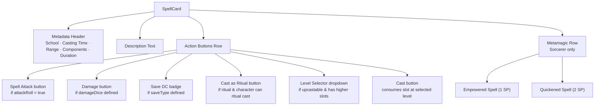

# Design Document: Enhanced Spell System

## Overview

This design replaces the current string-based spell lists on the Spells page with a rich, metadata-driven spell system. Each spell becomes a `SpellData` object containing its full D&D 2024 description, school, casting time, range, components, duration, damage dice, save type, attack roll flag, ritual tag, and upcasting rules. The existing Spells page is rebuilt around expandable `SpellCard` components that surface one-click spell attack rolls, damage rolls, save DC display, upcasting with a level selector, ritual casting, automatic spell slot consumption, and Metamagic integration for Sorcerers.

### Key Design Decisions

1. **Static Spell Registry**: All spell data is hardcoded in a single TypeScript file (`src/src/data/spell-registry.ts`) rather than fetched from an API. This keeps the app offline-capable and avoids runtime dependencies on external services. The registry is a `Record<string, SpellData>` keyed by spell name.

2. **Pure computation functions**: Spell attack bonus, save DC, upcast damage, slot consumption, and Metamagic SP cost are implemented as pure functions in dedicated modules (`src/src/app/spells/spell-calc.ts`). This makes them independently testable without React rendering.

3. **Reuse existing Dice_Roller**: Spell attack rolls and damage rolls feed into the existing `useDiceRoll` hook and `DiceResultOverlay`, matching the pattern already used on the Attack page. No new dice infrastructure is needed.

4. **Conditional Metamagic rendering**: Metamagic buttons appear only for Sorcerer characters (Madea), gated by `classResources.sorceryPointsMax !== undefined`, consistent with the existing pattern for class-specific UI.

5. **Wizard ritual casting from full spellbook**: Ramil can ritual-cast any ritual-tagged spell in his `spells` lists, even if not in `preparedSpells`. Madea cannot ritual cast (Shadow Sorcerers lack ritual casting in D&D 2024 rules).

6. **Cantrip scaling by character level**: Cantrip damage dice scale based on `data.level`, not class level, per D&D 5E rules (character level 5 = 2 dice, 11 = 3 dice, 17 = 4 dice).

## Architecture

```mermaid
graph TB
    subgraph SpellSystem ["Enhanced Spell System"]
        SR[spell-registry.ts<br/>Static SpellData lookup]
        SC[spell-calc.ts<br/>Pure computation functions]
        SP[SpellsPage<br/>page.tsx rewrite]
        SCard[SpellCard Component]
        MM[Metamagic buttons]
    end

    subgraph Existing ["Existing Infrastructure"]
        UCD[useCharacterData hook]
        UDR[useDiceRoll hook]
        DRO[DiceResultOverlay]
        API[/api/character/update]
        KV[(Vercel KV)]
    end

    SR -->|lookup| SCard
    SC -->|attack bonus, save DC,<br/>upcast dice, slot math| SCard
    SP --> SCard
    SCard --> MM
    SCard -->|rollDice| UDR
    UDR --> DRO
    SCard -->|mutate slots, SP| UCD
    UCD -->|persist| API
    API --> KV
```

### New Files

| File | Purpose |
|---|---|
| `src/src/data/spell-registry.ts` | Static `SPELL_REGISTRY: Record<string, SpellData>` with all spell metadata |
| `src/src/types/spell.ts` | `SpellData` interface and related types |
| `src/src/app/spells/spell-calc.ts` | Pure functions: `calcSpellAttackBonus`, `calcSpellSaveDC`, `calcUpcastDamage`, `calcCantripDice`, `canRitualCast`, `consumeSpellSlot`, `applyMetamagic` |
| `src/src/app/spells/SpellCard.tsx` | Expandable spell card component with action buttons |

### Modified Files

| File | Changes |
|---|---|
| `src/src/app/spells/page.tsx` | Rewrite to use `SpellCard` components, remove `COMMON_SPELL_DICE` quick-roller |
| `src/src/types/index.ts` | Re-export `SpellData` and related types from `./spell` |

## Components and Interfaces

### SpellCard Component

The `SpellCard` is the core UI element. It renders in two states:

**Collapsed** (default): Spell name, level badge, and optional ritual "R" badge. For Wizards, a prepared/auto indicator.

**Expanded** (on click): Full metadata header (school, casting time, range, components, duration), description text, and action buttons:



### SpellCard Props

```typescript
interface SpellCardProps {
  spellName: string;
  spellLevel: string;              // "cantrip" | "1st" | "2nd" | ...
  spellData: SpellData | undefined; // from registry lookup
  characterData: CharacterData;
  isExpanded: boolean;
  onToggle: () => void;
  onRollDice: (roll: DiceRoll) => void;
  onMutate: (partial: Partial<CharacterData>) => void;
  onWarning: (msg: string) => void;
}
```

### Pure Calculation Functions (spell-calc.ts)

```typescript
/** Spell attack modifier = proficiency + spellcasting ability modifier */
function calcSpellAttackBonus(
  proficiencyBonus: number,
  spellcastingAbility: AbilityName,
  stats: Record<AbilityName, { value: number; modifier: number }>
): number;

/** Spell save DC = 8 + proficiency + spellcasting ability modifier */
function calcSpellSaveDC(
  proficiencyBonus: number,
  spellcastingAbility: AbilityName,
  stats: Record<AbilityName, { value: number; modifier: number }>
): number;

/** Returns the damage dice string for a cantrip at the given character level */
function calcCantripDice(
  baseDice: string,          // e.g. "1d10"
  characterLevel: number
): string;                   // e.g. "2d10" at level 5

/** Returns the damage dice string when upcasting a spell */
function calcUpcastDamage(
  baseDamage: string,        // e.g. "8d6"
  baseLevel: number,         // e.g. 3
  castLevel: number,         // e.g. 5
  upcastPerLevel: string     // e.g. "1d6" per level above base
): string;                   // e.g. "10d6"

/** Whether a character can ritual-cast a given spell */
function canRitualCast(
  spell: SpellData,
  charClass: string,
  preparedSpells: string[],
  spellName: string
): boolean;

/** Attempt to consume a spell slot; returns new slot state or error */
function consumeSpellSlot(
  currentSlots: Record<string, number>,
  level: string
): { newSlots: Record<string, number>; success: boolean; error?: string };

/** Attempt to apply a Metamagic option; returns new SP or error */
function applyMetamagic(
  option: "empowered" | "quickened",
  currentSP: number
): { newSP: number; success: boolean; error?: string };
```

### Spellcasting Ability Resolution

The spellcasting ability is derived from `charClass`:
- Contains "Sorcerer" → `CHA`
- Contains "Wizard" → `INT`

This is resolved once in the page component and passed down to `SpellCard` and calc functions.

## Data Models

### SpellData Interface

```typescript
interface SpellData {
  name: string;
  level: number;                    // 0 for cantrip, 1-9 for leveled
  school: SpellSchool;
  castingTime: string;              // e.g. "1 action", "1 bonus action", "1 reaction"
  range: string;                    // e.g. "120 feet", "Self", "Touch"
  components: {
    verbal: boolean;
    somatic: boolean;
    material: boolean;
    materialDescription?: string;   // e.g. "a bit of phosphorus or a firefly"
  };
  duration: string;                 // e.g. "Instantaneous", "Concentration, up to 1 minute"
  description: string;              // Full spell text
  damageDice?: string;              // e.g. "8d6" (base damage)
  damageType?: string;              // e.g. "lightning", "fire"
  saveType?: AbilityName;           // e.g. "DEX" for Fireball
  attackRoll?: boolean;             // true for spell attack spells
  ritual?: boolean;                 // true for ritual-tagged spells
  upcast?: {
    perLevel: string;               // additional dice per level, e.g. "1d6"
  };
  cantripScaling?: boolean;         // true if cantrip damage scales with character level
}

type SpellSchool =
  | "Abjuration"
  | "Conjuration"
  | "Divination"
  | "Enchantment"
  | "Evocation"
  | "Illusion"
  | "Necromancy"
  | "Transmutation";
```

### Metamagic Constants

```typescript
const METAMAGIC_OPTIONS = {
  empowered: { name: "Empowered Spell", cost: 1 },
  quickened: { name: "Quickened Spell", cost: 2 },
} as const;
```

### Cantrip Scaling Table

Per D&D 5E rules, cantrip damage dice scale at character levels 5, 11, and 17:

```typescript
function cantripDiceMultiplier(characterLevel: number): number {
  if (characterLevel >= 17) return 4;
  if (characterLevel >= 11) return 3;
  if (characterLevel >= 5) return 2;
  return 1;
}
```

### Spell Slot Level Keys

Spell slot levels use the existing string keys from `CharacterData`: `"1st"`, `"2nd"`, `"3rd"`, etc. The `SpellData.level` numeric field maps to these via a lookup:

```typescript
const LEVEL_KEYS: Record<number, string> = {
  1: "1st", 2: "2nd", 3: "3rd", 4: "4th", 5: "5th",
  6: "6th", 7: "7th", 8: "8th", 9: "9th",
};
```


## Correctness Properties

*A property is a characteristic or behavior that should hold true across all valid executions of a system — essentially, a formal statement about what the system should do. Properties serve as the bridge between human-readable specifications and machine-verifiable correctness guarantees.*

### Property 1: Spell registry completeness and data consistency

*For all* spell names in both characters' cantrip and spell lists, the `SPELL_REGISTRY` must contain a `SpellData` entry with non-empty `name`, valid `level` (0–9), non-empty `school`, `castingTime`, `range`, `duration`, and `description`. Additionally, *for all* `SpellData` entries where `damageDice` is defined, `damageType` must also be defined (and vice versa); where `saveType` is defined, it must be a valid `AbilityName`; and where `upcast` is defined, `upcast.perLevel` must be a valid dice expression.

**Validates: Requirements 1.1, 1.2, 1.3, 1.4, 1.5, 1.8**

### Property 2: Spell attack bonus calculation

*For any* valid proficiency bonus (1–6) and any valid ability modifier (−5 to +5), `calcSpellAttackBonus(proficiency, ability, stats)` shall return exactly `proficiency + stats[ability].modifier`.

**Validates: Requirements 3.2, 3.3**

### Property 3: Spell save DC calculation

*For any* valid proficiency bonus (1–6) and any valid ability modifier (−5 to +5), `calcSpellSaveDC(proficiency, ability, stats)` shall return exactly `8 + proficiency + stats[ability].modifier`.

**Validates: Requirements 5.2**

### Property 4: Cantrip damage scaling

*For any* cantrip with a base damage dice expression (e.g. "1d10") and any character level (1–20), `calcCantripDice(baseDice, level)` shall return a dice expression whose count equals the base count multiplied by the cantrip scaling multiplier (1 at levels 1–4, 2 at levels 5–10, 3 at levels 11–16, 4 at levels 17–20), with the die size unchanged.

**Validates: Requirements 4.3**

### Property 5: Upcast damage calculation

*For any* spell with base damage dice, a base spell level, a cast level strictly greater than the base level, and an upcast `perLevel` dice expression, `calcUpcastDamage(baseDamage, baseLevel, castLevel, perLevel)` shall return a dice expression whose count equals the base count plus `(castLevel - baseLevel) * perLevel count`, with the die size unchanged.

**Validates: Requirements 6.2**

### Property 6: Spell slot consumption

*For any* spell slot state where the slot count at a given level is at least 1, `consumeSpellSlot(currentSlots, level)` shall return `success: true` with the slot count at that level decremented by exactly 1 and all other levels unchanged. *For any* state where the slot count at the given level is 0, it shall return `success: false`.

**Validates: Requirements 6.3, 6.4, 8.1, 8.3**

### Property 7: Ritual casting class rules

*For any* spell with `ritual: true`, `canRitualCast` shall return `true` for a Wizard character regardless of whether the spell is in the prepared spell list. *For any* spell and a Sorcerer character, `canRitualCast` shall return `false`.

**Validates: Requirements 7.3, 7.4**

### Property 8: Metamagic sorcery point consumption

*For any* Metamagic option ("empowered" with cost 1, "quickened" with cost 2) and any current sorcery point total, `applyMetamagic(option, currentSP)` shall return `success: true` with `newSP = currentSP - cost` when `currentSP >= cost`, and `success: false` with `newSP` unchanged when `currentSP < cost`.

**Validates: Requirements 9.3, 9.4, 9.6, 9.7**

### Property 9: Spell data serialization round-trip

*For any* valid `SpellData` object (including those with upcast configurations, damage dice, save types, and ritual flags), `JSON.parse(JSON.stringify(spellData))` shall produce an object deeply equal to the original.

**Validates: Requirements 10.1, 10.2**

## Error Handling

| Scenario | Behavior |
|---|---|
| Spell not found in registry | `SpellCard` renders spell name only (collapsed), no action buttons. Graceful degradation — the card still appears but without metadata or roll buttons. |
| No spell slots remaining at cast level | `consumeSpellSlot` returns `{ success: false, error }`. UI displays a warning banner (2-second auto-dismiss) and does not trigger the dice roller. |
| Insufficient sorcery points for Metamagic | `applyMetamagic` returns `{ success: false }`. The Metamagic button is disabled (grayed out) when SP < cost. Clicking a disabled button is a no-op. |
| Invalid dice expression in registry | `parseDiceExpression` returns `null`. The "Damage" button is hidden for that spell. Logged as a console warning in development. |
| Upcast level exceeds available slots | The level selector only shows levels where the character has remaining slots. If all higher slots are exhausted, the selector shows only the base level. |
| Character data not loaded yet | Page shows "Loading..." spinner. No spell cards render until `useCharacterData` resolves. |
| Persist failure (network error) | `useAutoSave` retries on next debounce cycle. Optimistic local state is preserved. The existing error handling in `useCharacterData` applies. |

## Testing Strategy

### Property-Based Tests

Property-based tests use **fast-check** (`fc`) for TypeScript. Each property test runs a minimum of 100 iterations with randomly generated inputs.

Each test is tagged with a comment referencing the design property:
```
// Feature: enhanced-spell-system, Property N: <property title>
```

| Property | Test File | What It Generates |
|---|---|---|
| P1: Registry completeness | `src/src/data/__tests__/spell-registry.property.test.ts` | Iterates over all character spell names, validates each registry entry's fields and conditional consistency |
| P2: Spell attack bonus | `src/src/app/spells/__tests__/spell-calc.property.test.ts` | Random proficiency (1–6), random ability modifiers (−5 to +5) |
| P3: Spell save DC | Same file as P2 | Random proficiency (1–6), random ability modifiers (−5 to +5) |
| P4: Cantrip scaling | Same file as P2 | Random base dice expressions, random character levels (1–20) |
| P5: Upcast damage | Same file as P2 | Random base damage, random base/cast level pairs, random perLevel dice |
| P6: Slot consumption | Same file as P2 | Random slot states (0–4 slots per level), random target levels |
| P7: Ritual casting rules | Same file as P2 | Random class strings (Wizard/Sorcerer), random spell ritual flags, random prepared lists |
| P8: Metamagic SP | Same file as P2 | Random SP totals (0–20), random Metamagic options |
| P9: Serialization round-trip | `src/src/types/__tests__/spell.property.test.ts` | Random valid SpellData objects with all optional fields varied |

### Unit Tests

Unit tests complement property tests by covering specific examples, edge cases, and integration points:

| Area | Test File | Coverage |
|---|---|---|
| SpellCard rendering | `src/src/app/spells/__tests__/SpellCard.test.tsx` | Expand/collapse toggle, ritual badge display, button visibility based on spell flags, Metamagic buttons for Sorcerer only, level selector for upcastable spells |
| Cantrip edge cases | `src/src/app/spells/__tests__/spell-calc.test.ts` | Level 1 (no scaling), level 5 boundary, level 20 max |
| Slot consumption edge cases | Same file | 0 slots remaining, consuming created (SP-converted) slots |
| Metamagic edge cases | Same file | Exactly 1 SP with Empowered, exactly 2 SP with Quickened, 0 SP |
| Dice expression parsing | Same file | "8d6", "1d10", "2d8", invalid strings |

### Test Configuration

- Test runner: Vitest (already configured in the project)
- Property-based testing library: **fast-check**
- Minimum iterations per property test: 100
- Each property-based test references its design property via comment tag:
  `// Feature: enhanced-spell-system, Property {number}: {property title}`
- Each correctness property is implemented by a single property-based test
