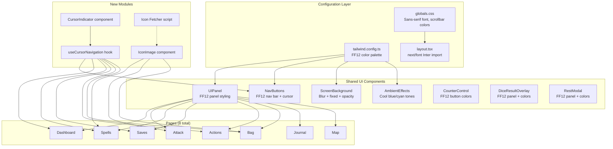

# Design Document: FF12 Visual Overhaul

## Overview

This design transforms the D&D Character Tracker from its current dark-fantasy/parchment/gold aesthetic into a Final Fantasy XII-inspired UI. The overhaul touches every visual layer — color palette, typography, panel styling, navigation, backgrounds, ambient effects — while preserving all existing application logic, data persistence, and functionality unchanged.

The key visual pillars of FF12's UI are:
- Semi-transparent dark blue-grey panels with thin bright borders
- Clean sans-serif typography
- An animated cursor (▶) selection system for list navigation
- Blurred, atmospheric background images
- Cool blue/cyan ambient tones instead of warm amber/gold

The implementation strategy is to modify shared UI components (UIPanel, NavButtons, ScreenBackground, AmbientEffects, CounterControl) and the Tailwind config first, then sweep through each page to replace hardcoded color classes. A new `useCursorNavigation` hook provides the cursor selection system as a reusable primitive. A standalone icon fetcher script downloads spell/weapon icons from the BG3 wiki for display in lists.

## Architecture

The overhaul follows a layered approach that minimizes page-level changes by concentrating visual logic in shared components and configuration:



### Change Propagation Strategy

1. **Tailwind config** — Replace color tokens. All components using `text-parchment`, `bg-dark-surface`, `border-gold-dark`, etc. automatically pick up new values.
2. **Shared components** — UIPanel, NavButtons, ScreenBackground, AmbientEffects get FF12 styling. Since every page imports these, the visual change cascades.
3. **Page-level sweep** — Replace remaining hardcoded color classes (`text-gold`, `bg-crimson`, `font-serif`) with FF12 equivalents. This is mostly find-and-replace within Tailwind classes.
4. **New hook + component** — `useCursorNavigation` and `CursorIndicator` are added to interactive lists incrementally.

## Components and Interfaces

### 1. `useCursorNavigation` Hook

A custom React hook that manages cursor position state and keyboard navigation for any list of interactive items.

```typescript
// src/hooks/useCursorNavigation.ts

interface CursorNavigationOptions {
  /** Total number of items in the list */
  itemCount: number;
  /** Number of columns for grid layouts (default: 1) */
  columns?: number;
  /** Callback when Enter/Space is pressed on the active item */
  onActivate?: (index: number) => void;
  /** Whether this list is currently the active focus target */
  enabled?: boolean;
}

interface CursorNavigationResult {
  /** Currently selected index (-1 = none) */
  activeIndex: number;
  /** Set active index (for mouse hover) */
  setActiveIndex: (index: number) => void;
  /** Props to spread on the list container */
  containerProps: {
    tabIndex: number;
    role: string;
    onKeyDown: (e: React.KeyboardEvent) => void;
    onMouseLeave: () => void;
    'aria-activedescendant': string | undefined;
  };
  /** Generate props for each list item */
  getItemProps: (index: number) => {
    id: string;
    role: string;
    'aria-selected': boolean;
    onMouseEnter: () => void;
    onClick: () => void;
  };
  /** Whether the given index is the active one */
  isActive: (index: number) => boolean;
}

function useCursorNavigation(options: CursorNavigationOptions): CursorNavigationResult;
```

Key behaviors:
- ArrowUp/ArrowDown moves cursor vertically, ArrowLeft/ArrowRight moves across columns
- No wrapping at list boundaries (clamped to first/last item)
- Enter/Space triggers `onActivate` callback
- Mouse hover sets `activeIndex`, mouse leave resets to -1
- `enabled` flag allows multiple lists on a page without conflict (only one active at a time)
- Generates ARIA attributes for accessibility (`role="listbox"`, `role="option"`, `aria-selected`, `aria-activedescendant`)

### 2. `CursorIndicator` Component

A small presentational component rendering the animated ▶ arrow.

```typescript
// src/components/ui/CursorIndicator.tsx

interface CursorIndicatorProps {
  visible: boolean;
  className?: string;
}

function CursorIndicator({ visible, className }: CursorIndicatorProps): JSX.Element;
```

- Renders a 14px bright white/light-blue ▶ character
- Animated with a gentle horizontal oscillation using CSS keyframes (translateX 0px → 3px → 0px, 1s ease-in-out infinite)
- `visible=false` renders an invisible spacer of the same width to prevent layout shift

### 3. `UIPanel` Component (Redesigned)

The existing UIPanel keeps its prop interface but all variants map to FF12 styling.

```typescript
// Updated VARIANT_STYLES
const VARIANT_STYLES: Record<string, string> = {
  box:   "bg-ff12-panel/70 border-ff12-border",
  box1:  "bg-ff12-panel/65 border-ff12-border",
  box2:  "bg-ff12-panel/60 border-ff12-border-dim",
  box4:  "bg-ff12-panel/75 border-ff12-border",
  dark:  "bg-ff12-panel-dark/80 border-ff12-border-dim",
  fancy: "bg-ff12-panel/70 border-ff12-border-bright",
};
```

Changes:
- `rounded-lg` → `rounded` (4px or less for FF12's near-rectangular shape)
- Add `shadow-ff12-glow` for subtle inner glow along border edges
- Border width stays at 1px (Tailwind default `border`), with an option for `border-2` on `fancy` variant
- The `fancy` variant gets a slightly brighter top border via `border-t-ff12-border-bright`

### 4. `NavButtons` Component (Redesigned)

Transforms from a scrollable tab bar into an FF12-style horizontal menu bar.

```typescript
// Key changes:
// - Sticky positioning at top of viewport
// - FF12 panel styling (semi-transparent bg, thin border)
// - CursorIndicator next to hovered/selected link
// - useCursorNavigation for ArrowLeft/ArrowRight keyboard nav
// - Active page: white text + subtle bg highlight
// - Inactive pages: blue-grey text
// - Logout button at right end, visually separated
```

### 5. `ScreenBackground` Component (Updated)

```typescript
// Changes:
// - Add blur-[6px] filter to the Image
// - Change from relative to fixed positioning
// - Reduce opacity from 40% to ~35%
// - Add w-screen h-screen with object-cover
// - Wrap in a fixed container div
```

### 6. `AmbientEffects` Component (Updated)

Color palette shift from warm amber/orange to cool blue/cyan:
- Dashboard: firepit glow → cool blue pulse, moonlight stays
- Submenu screens: amber light rays → blue-cyan light rays, amber dust → blue-white dust particles

### 7. `IconImage` Component

A small utility component for displaying spell/weapon/item icons with fallback.

```typescript
// src/components/ui/IconImage.tsx

interface IconImageProps {
  type: 'spell' | 'weapon' | 'item';
  name: string;
  size?: number; // default 24
  className?: string;
}

function IconImage({ type, name, size, className }: IconImageProps): JSX.Element;
```

- Resolves path: `public/images/icons/{type}s/{name-kebab}.png`
- Falls back to a generic placeholder icon per type
- Uses `next/image` with specified dimensions

### 8. Icon Fetcher Script

A standalone Node.js/TypeScript script for downloading icons.

```typescript
// scripts/fetch-icons.ts
// Run: npx ts-node scripts/fetch-icons.ts

// 1. Reads spell names from src/data/spell-registry.ts exports
// 2. Reads weapon names from character data JSON
// 3. For each name, fetches the BG3 wiki page: https://bg3.wiki/wiki/{Name}
// 4. Parses the page HTML to find the icon image URL
// 5. Downloads the icon to public/images/icons/spells/ or weapons/
// 6. Filename: lowercase, spaces → hyphens (e.g., "Fire Bolt" → "fire-bolt.png")
// 7. Skips if file already exists locally
// 8. Logs warnings for missing icons, continues processing
```

## Data Models

No data model changes are required. This is a purely visual overhaul — all existing TypeScript interfaces (`CharacterData`, `SpellData`, `Weapon`, `MapMarker`, etc.) remain unchanged.

### New Tailwind Color Tokens

Added to `tailwind.config.ts` under `theme.extend.colors`:

```typescript
// FF12 panel backgrounds
"ff12-panel":        "#1e2a3a",   // dark navy/blue-grey
"ff12-panel-dark":   "#141e2b",   // darker variant
"ff12-panel-light":  "#243044",   // lighter variant

// FF12 borders
"ff12-border":       "#5a8aaa",   // standard panel border
"ff12-border-dim":   "#3a6080",   // dimmer border
"ff12-border-bright":"#8ebed8",   // bright/highlight border

// FF12 text
"ff12-text":         "#e0e8f0",   // primary text (light grey)
"ff12-text-dim":     "#8899aa",   // secondary text (blue-grey)
"ff12-text-bright":  "#ffffff",   // selection/highlight text

// FF12 accents
"ff12-select":       "#7ec8e3",   // selection highlight blue
"ff12-hp-start":     "#2d8a4e",   // HP bar gradient start
"ff12-hp-end":       "#4aba6a",   // HP bar gradient end
"ff12-danger":       "#a04040",   // soft red for destructive actions
```

Existing tokens (`gold`, `parchment`, `dark-*`, `crimson`) are preserved in config for backward compatibility during migration but will be systematically replaced in component classes.

### New Font Configuration

```typescript
// layout.tsx
import { Inter } from 'next/font/google';

const inter = Inter({
  subsets: ['latin'],
  variable: '--font-inter',
  display: 'swap',
});

// Applied to <body> className
```

```typescript
// tailwind.config.ts — updated fontFamily
fontFamily: {
  sans: ['var(--font-inter)', 'Inter', 'Segoe UI', 'system-ui', 'sans-serif'],
},
```

### New CSS Additions (globals.css)

```css
/* Cursor indicator animation */
@keyframes cursor-pulse {
  0%, 100% { transform: translateX(0); }
  50% { transform: translateX(3px); }
}

.animate-cursor-pulse {
  animation: cursor-pulse 1s ease-in-out infinite;
}

/* Tabular numbers for stat displays */
.tabular-nums {
  font-variant-numeric: tabular-nums;
}
```

### Page-Level Changes Summary

Each page follows the same pattern:
1. Replace `text-parchment` → `text-ff12-text`, `text-parchment/70` → `text-ff12-text-dim`
2. Replace `text-gold` → `text-gold` (kept for stat values) or `text-ff12-select` (for highlights)
3. Replace `bg-crimson` → `bg-ff12-danger`, `bg-gold-dark` → `bg-ff12-panel-light`
4. Replace `font-serif` → remove (sans-serif is now default)
5. Replace `bg-dark-border` → `bg-ff12-panel-light`
6. Add `useCursorNavigation` to interactive lists
7. Add `IconImage` next to spell/weapon/item names
8. HP bar: `bg-crimson` → green gradient (`bg-gradient-to-r from-ff12-hp-start to-ff12-hp-end`)

| Page | Cursor Lists | Icons | Special Notes |
|------|-------------|-------|---------------|
| Dashboard | Skills list, Ability scores grid | — | HP bar green gradient, stat values keep gold |
| Attack | Weapon cards, Roll mode buttons | Weapon icons (24px) | Spell-created weapon border → ff12-select |
| Spells | Spell lists (per level), Cantrips | Spell icons (24px) | SpellCard component also updated |
| Saves | Saving throw buttons | — | Proficiency dot stays gold |
| Actions | Action cards, Universal actions | — | Bladesong/Raven Form panels updated |
| Bag | Inventory items (gear/utility/treasure) | Item icons (20px) | Equipped/Attuned badges updated |
| Journal | Session list, NPC list, Places list | — | Editor textarea border updated |
| Map | Category filter buttons, Floor buttons | — | Map marker icons unchanged |


## Correctness Properties

*A property is a characteristic or behavior that should hold true across all valid executions of a system — essentially, a formal statement about what the system should do. Properties serve as the bridge between human-readable specifications and machine-verifiable correctness guarantees.*

### Property 1: UIPanel FF12 Styling Invariant

*For any* valid UIPanel variant string ("box", "box1", "box2", "box4", "dark", "fancy"), the rendered panel element SHALL contain FF12 panel background classes (containing "ff12-panel"), an FF12 border class (containing "ff12-border"), and use `rounded` (not `rounded-lg`) for corner radius.

**Validates: Requirements 1.1, 1.2, 1.4**

### Property 2: Cursor Navigation Grid Movement

*For any* list of length N (N ≥ 1), any column count C (C ≥ 1), and any current activeIndex i (0 ≤ i < N), pressing an arrow key SHALL produce a new activeIndex according to: ArrowDown → min(i + C, N - 1), ArrowUp → max(i - C, 0), ArrowRight → i + 1 if (i + 1) % C ≠ 0 and i + 1 < N else i, ArrowLeft → i - 1 if i % C ≠ 0 else i. The result is always clamped to [0, N - 1] with no wrapping.

**Validates: Requirements 2.2, 2.3, 2.4, 2.5, 2.9, 2.10**

### Property 3: Cursor Activation Dispatches Callback

*For any* list of length N and any activeIndex i (0 ≤ i < N), pressing Enter or Space SHALL invoke the onActivate callback with argument i exactly once.

**Validates: Requirements 2.6**

### Property 4: Cursor Indicator Visibility on Hover

*For any* list of length N and any index i (0 ≤ i < N), when activeIndex equals i, exactly one CursorIndicator in the list SHALL be visible (at position i), and all others SHALL be hidden.

**Validates: Requirements 2.1**

### Property 5: ScreenBackground FF12 Styling

*For any* valid screen prop string ("dashboard", "attack", "spells", "saves", "actions", "bag", "journal"), the ScreenBackground component SHALL render with a blur filter class, fixed positioning, and an opacity value between 30–50%.

**Validates: Requirements 3.1, 3.2, 3.4**

### Property 6: Interactive List Hover Highlight

*For any* item in an Interactive_List that is currently active (hovered or keyboard-selected), the item's rendered element SHALL include a background highlight class with low opacity (10–20% white or light-blue tint), and non-active items SHALL not have this highlight class.

**Validates: Requirements 4.5**

### Property 7: AmbientEffects Cool Palette

*For any* valid screen prop string, the AmbientEffects component SHALL render color classes containing blue or cyan tones (e.g., "blue", "cyan") and SHALL NOT render warm amber or orange color classes.

**Validates: Requirements 4.6**

### Property 8: Icon Filename Derivation

*For any* non-empty item name string, the icon filename derivation function SHALL produce a lowercase string with spaces replaced by hyphens, containing only alphanumeric characters and hyphens, ending with ".png".

**Validates: Requirements 5.2**

### Property 9: NavButtons Active Page Styling

*For any* valid page pathname from the SCREENS array, the NavButtons component SHALL render the matching link with a visually distinct style (brighter text class) compared to all non-matching links (dimmer text class).

**Validates: Requirements 7.5**

### Property 10: NavButtons Cursor Indicator

*For any* navigation link index that is the current activeIndex in the NavButtons cursor system, a CursorIndicator SHALL be visible adjacent to that link, and CursorIndicators for all other links SHALL be hidden.

**Validates: Requirements 7.2**

## Error Handling

### Icon Fetcher Errors
- **Network failure**: The fetch-icons script catches HTTP errors per-icon and logs a warning with the icon name and HTTP status. Processing continues with remaining icons.
- **Missing wiki page**: If the BG3 wiki returns 404 for an item name, the script logs a warning and skips that icon. No placeholder is auto-generated — the app's `IconImage` component handles missing files at runtime via its fallback.
- **Invalid HTML parsing**: If the wiki page structure changes and the icon URL cannot be extracted, the script logs a parsing error and skips.
- **File system errors**: If the target directory doesn't exist, the script creates it. If a write fails, it logs the error and continues.

### IconImage Runtime Fallback
- The `IconImage` component uses Next.js `<Image>` with an `onError` handler that swaps to a generic placeholder icon (`/images/icons/placeholder-spell.png`, `/images/icons/placeholder-weapon.png`, `/images/icons/placeholder-item.png`).
- If even the placeholder is missing, the component renders nothing (graceful degradation).

### Cursor Navigation Edge Cases
- **Empty list** (itemCount = 0): The hook returns activeIndex = -1 and all keyboard events are no-ops.
- **Single item list**: ArrowUp/ArrowDown are no-ops; the single item stays selected.
- **Component unmount during animation**: The CursorIndicator uses CSS animations only (no JS timers), so unmounting is clean.
- **Multiple lists on same page**: Only the list with `enabled=true` responds to keyboard events. Mouse hover works independently on all lists.

### Font Loading
- The Inter font is loaded via `next/font` with `display: 'swap'`, ensuring text remains visible during font load with the system sans-serif fallback.

## Testing Strategy

### Dual Testing Approach

This feature requires both unit tests and property-based tests:

- **Property-based tests** verify universal properties across randomly generated inputs (list sizes, indices, variant strings, screen names, item names). These use the `fast-check` library already in devDependencies.
- **Unit tests** verify specific examples, edge cases, and visual integration points using Vitest.

### Property-Based Testing Configuration

- Library: `fast-check` (already installed as devDependency)
- Minimum 100 iterations per property test
- Each property test MUST be tagged with a comment referencing the design property:
  ```
  // Feature: ff12-visual-overhaul, Property {N}: {property title}
  ```
- Each correctness property is implemented by a SINGLE property-based test

### Property Test Plan

| Property | Test File | What's Generated |
|----------|-----------|-----------------|
| P1: UIPanel FF12 Styling | `src/components/ui/__tests__/UIPanel.property.test.tsx` | Random variant strings from the valid set |
| P2: Cursor Navigation | `src/hooks/__tests__/useCursorNavigation.property.test.ts` | Random (itemCount, columns, activeIndex, arrowKey) tuples |
| P3: Cursor Activation | `src/hooks/__tests__/useCursorNavigation.property.test.ts` | Random (itemCount, activeIndex, key∈{Enter,Space}) |
| P4: Cursor Visibility | `src/hooks/__tests__/useCursorNavigation.property.test.ts` | Random (itemCount, activeIndex) |
| P5: ScreenBackground Styling | `src/components/ui/__tests__/ScreenBackground.property.test.tsx` | Random screen strings from valid set |
| P6: Hover Highlight | `src/hooks/__tests__/useCursorNavigation.property.test.ts` | Random (itemCount, activeIndex) |
| P7: AmbientEffects Palette | `src/components/ui/__tests__/AmbientEffects.property.test.tsx` | Random screen strings from valid set |
| P8: Icon Filename | `scripts/__tests__/icon-filename.property.test.ts` | Random non-empty strings with spaces, special chars |
| P9: NavButtons Active Styling | `src/components/ui/__tests__/NavButtons.property.test.tsx` | Random pathname from SCREENS |
| P10: NavButtons Cursor | `src/components/ui/__tests__/NavButtons.property.test.tsx` | Random activeIndex within nav items |

### Unit Test Plan

- **UIPanel**: Verify `fancy` variant has brighter top border class (Req 1.6), verify inner glow shadow class (Req 1.3)
- **CursorIndicator**: Verify animation class present (Req 2.7), verify dimensions ~14px (Req 2.11)
- **ScreenBackground**: Verify `object-cover` and viewport sizing (Req 3.3)
- **Tailwind config**: Verify FF12 color tokens exist with expected hex values (Req 4.1)
- **Dashboard HP bar**: Verify green gradient classes replace crimson (Req 4.2)
- **IconImage**: Verify fallback renders when icon missing (Req 5.5, 5.6, 5.7), verify correct dimensions per type
- **Icon Fetcher**: Verify skip-existing behavior (Req 5.3), verify graceful error on missing icon (Req 5.4)
- **Typography**: Verify Inter font import in layout (Req 6.1, 6.2), verify base font size (Req 6.5)
- **NavButtons**: Verify sticky positioning and FF12 panel classes (Req 7.1, 7.7), verify Logout button separation (Req 7.6)
