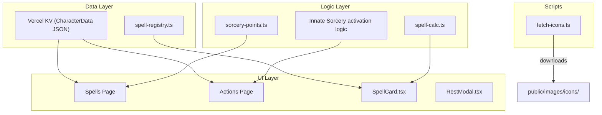

# Design Document: Madea Level-Up (5 → 7)

## Overview

This design covers all changes needed to level Madea (Shadow Sorcerer) from level 5 to level 7 in the Next.js D&D Character Tracker. The work spans four areas:

1. **Character data migration** — Update level, proficiency bonus, HP, spell slots, sorcery points, and spell lists in the Vercel KV–stored `CharacterData` JSON.
2. **Spell registry additions** — Add Counterspell (3rd) and Banishment (4th) to `SPELL_REGISTRY` with full metadata.
3. **Sorcery point module extension** — Add 4th-level slot support to `SP_TO_SLOT_COST`, `slotLevelNumber`, and the conversion functions.
4. **Sorcery Incarnate fix** — Rewrite Innate Sorcery activation logic so the first 2 uses per long rest are free, and subsequent uses cost 2 SP each.
5. **Icon assets** — Download BG3 wiki icons for Counterspell, Banishment, and three familiars (fox, hound, falcon/raven).

The changes are mostly data-level (JSON migration + registry entries) with two logic changes: extending the SP conversion module and fixing the Innate Sorcery activation function.

## Architecture

The existing architecture remains unchanged. All modifications fit within the current module boundaries:



No new modules or components are introduced. The migration is a one-time data update applied to the Vercel KV store.

## Components and Interfaces

### 1. Character Data Migration

A one-time update to Madea's `CharacterData` in Vercel KV. This can be done via the existing migration script pattern (`src/scripts/migrate.ts`) or a manual KV update.

**Fields to update:**

| Field | Old Value | New Value | Rationale |
|-------|-----------|-----------|-----------|
| `level` | 5 | 7 | Req 1.1 |
| `proficiencyBonus` | 2 | 3 | Req 1.2 (level 7 = proficiency 3) |
| `maxHp` | current | current + 16 | Req 2.1: 2 × (4 + 2) + 4 = 16 (CON mod = +2, Tough = +4) |
| `currentHp` | current | current + 16 | Req 2.2 |
| `spellSlots["3rd"]` | undefined | 1 | Req 3.1 |
| `currentSpellSlots["3rd"]` | undefined | 1 | Req 3.2 |
| `spellSlots["4th"]` | undefined | 1 | Req 3.3 |
| `currentSpellSlots["4th"]` | undefined | 1 | Req 3.4 |
| `spells["3rd"]` | existing | append "Counterspell" | Req 4.3 |
| `spells["4th"]` | undefined | ["Banishment"] | Req 5.4 |
| `classResources.sorceryPointsMax` | 5 | 7 | Req 6.1 |
| `classResources.currentSorceryPoints` | current | 7 | Req 6.2 |
| `classResources.innateSorceryMaxUses` | undefined/0 | 2 | Req 8.5 |
| `classResources.innateSorceryUsesRemaining` | undefined/0 | 2 | Req 8.4 (fresh long rest state) |

### 2. Spell Registry Additions

Two new entries in `src/src/data/spell-registry.ts`:

**Counterspell:**
```typescript
"Counterspell": {
  name: "Counterspell",
  level: 3,
  school: "Abjuration",
  castingTime: "1 reaction, which you take when you see a creature within 60 feet of yourself casting a spell with Verbal, Somatic, or Material components",
  range: "60 feet",
  components: { verbal: false, somatic: true, material: false },
  duration: "Instantaneous",
  description: "You attempt to interrupt a creature in the process of casting a spell. The creature must make a Constitution saving throw. On a failed save, the creature's spell fails and has no effect.",
  saveType: "CON",
}
```

**Banishment:**
```typescript
"Banishment": {
  name: "Banishment",
  level: 4,
  school: "Abjuration",
  castingTime: "1 action",
  range: "30 feet",
  components: { verbal: true, somatic: true, material: true, materialDescription: "a pentacle" },
  duration: "Concentration, up to 1 minute",
  description: "You attempt to send one creature that you can see within range to another plane of existence. The target must succeed on a Charisma saving throw or be banished.",
  saveType: "CHA",
  upcast: { perLevel: "1 target" },
  upcastDescription: "When you cast this spell using a spell slot of 5th level or higher, you can target one additional creature for each slot level above 4th.",
}
```

### 3. Sorcery Point Module Extension

In `src/src/app/spells/sorcery-points.ts`:

- Add `"4th": 6` to `SP_TO_SLOT_COST`
- Add `"4th": 4` to the `slotLevelNumber` map
- No changes to `convertSpToSlot` or `convertSlotToSp` — they already use the lookup tables generically

### 4. Sorcery Incarnate Fix (Innate Sorcery Activation)

The current implementation (visible in `innate-sorcery.property.test.ts`) always deducts 2 SP on activation. The fix introduces a two-phase activation:

**New logic:**
```
function activateInnateSorcery(cr: ClassResources): ClassResources | null {
  if (cr.innateSorceryActive) return null;

  // Phase 1: Free uses remaining
  if ((cr.innateSorceryUsesRemaining ?? 0) > 0) {
    return {
      ...cr,
      innateSorceryActive: true,
      innateSorceryUsesRemaining: (cr.innateSorceryUsesRemaining ?? 0) - 1,
      // No SP deduction
    };
  }

  // Phase 2: No free uses — costs 2 SP
  if ((cr.currentSorceryPoints ?? 0) >= 2) {
    return {
      ...cr,
      innateSorceryActive: true,
      currentSorceryPoints: (cr.currentSorceryPoints ?? 0) - 2,
      // No uses decremented
    };
  }

  // Cannot activate
  return null;
}
```

**Updated disable guard:**
```
function isActivateDisabled(cr: ClassResources): boolean {
  if (cr.innateSorceryActive) return false;
  // Can activate if free uses remain OR if SP >= 2
  return (cr.innateSorceryUsesRemaining ?? 0) === 0 && (cr.currentSorceryPoints ?? 0) < 2;
}
```

The long rest reset already handles `innateSorceryUsesRemaining` correctly (resets to `innateSorceryMaxUses`), as confirmed in `long-rest-innate-sorcery.property.test.ts`.

### 5. Icon Downloads

The existing `fetch-icons.ts` script handles spell icons automatically by iterating `SPELL_REGISTRY` keys. Adding Counterspell and Banishment to the registry means running the script will download their icons.

For familiar icons, the script needs manual entries or a separate download step targeting:
- `public/images/icons/familiars/fox.png` — BG3 wiki "Find Familiar Scratch" icon
- `public/images/icons/familiars/hound.png` — BG3 wiki "Hound of Ill Omen" icon
- `public/images/icons/familiars/falcon.png` — BG3 wiki "Find Familiar Raven" icon

### 6. Hound of Ill Omen Verification

The Hound of Ill Omen entry already exists in `SPELL_REGISTRY` at level 0. The character data should already include it. Requirement 11 is a verification step — no code change needed unless the entry is missing from the character's spell data.

## Data Models

No new types are introduced. All changes use existing interfaces:

- `CharacterData` — field value updates only (level, HP, spell slots, spells, classResources)
- `ClassResources` — `innateSorceryMaxUses` and `innateSorceryUsesRemaining` already exist in the type definition
- `SpellData` — Counterspell and Banishment use existing fields (no new properties needed)
- `SP_TO_SLOT_COST` — extended with one new key-value pair

The `SpellData` interface already supports all fields needed for both new spells (`saveType`, `upcast`, `upcastDescription`, `components` with `materialDescription`).


## Correctness Properties

*A property is a characteristic or behavior that should hold true across all valid executions of a system — essentially, a formal statement about what the system should do. Properties serve as the bridge between human-readable specifications and machine-verifiable correctness guarantees.*

### Property 1: SP-to-slot and slot-to-SP conversions maintain resource conservation for all levels including 4th

*For any* valid `ConversionState` and *for any* slot level in {"1st", "2nd", "3rd", "4th"}:
- When converting SP to a slot succeeds, the SP spent equals exactly the defined cost (2/3/5/6) and the slot count increases by exactly 1.
- When converting a slot to SP succeeds, the SP gained equals the slot's numeric level (1/2/3/4), capped at `sorceryPointsMax`, and the slot count decreases by exactly 1.
- When SP is insufficient for the conversion, the operation fails and state is unchanged.
- A round-trip (SP→slot→SP) never creates SP out of nothing (cost > gain for all levels).

**Validates: Requirements 7.1, 7.2, 7.3, 7.4, 7.5**

### Property 2: Innate Sorcery two-phase activation follows correct cost path

*For any* `ClassResources` where `innateSorceryActive` is false:
- If `innateSorceryUsesRemaining > 0`, activation SHALL set `innateSorceryActive` to true, decrement `innateSorceryUsesRemaining` by 1, and leave `currentSorceryPoints` unchanged.
- If `innateSorceryUsesRemaining === 0` and `currentSorceryPoints >= 2`, activation SHALL set `innateSorceryActive` to true, deduct 2 from `currentSorceryPoints`, and leave `innateSorceryUsesRemaining` unchanged.
- If `innateSorceryUsesRemaining === 0` and `currentSorceryPoints < 2`, activation SHALL return null (cannot activate).

**Validates: Requirements 8.1, 8.2, 8.3**

### Property 3: Innate Sorcery activate button disabled iff no free uses AND insufficient SP

*For any* `ClassResources` where `innateSorceryActive` is false, the activate button is disabled if and only if `innateSorceryUsesRemaining === 0` AND `currentSorceryPoints < 2`. This is the logical OR of the two activation paths — the button is enabled when either path is available.

**Validates: Requirements 8.3**

## Error Handling

| Scenario | Handling |
|----------|----------|
| SP-to-slot conversion with insufficient SP | `convertSpToSlot` returns `{ success: false, error: "Not enough sorcery points" }` — no state mutation |
| SP-to-slot conversion with invalid level key | Returns `{ success: false, error: "Invalid slot level: ..." }` |
| Slot-to-SP conversion with no slots available | Returns `{ success: false, error: "No slots to convert" }` |
| Innate Sorcery activation when already active | Returns `null` — UI should not show the activate button when already active |
| Innate Sorcery activation with no uses and insufficient SP | Returns `null` — UI disables the button |
| Icon download failure (network/wiki unavailable) | `fetch-icons.ts` logs a warning and continues to next icon — non-blocking |
| Missing spell in registry | `SpellCard` renders "No spell data available in registry" fallback |

## Testing Strategy

### Property-Based Tests (fast-check, vitest)

Property-based testing applies to the two pure logic modules being modified:

1. **SP conversion (extended)** — Extend the existing `sorcery-points.property.test.ts` to include `"4th"` in the slot level arbitrary. The existing three property tests (cost deduction, SP gain, round-trip conservation) will automatically cover 4th-level slots. Minimum 100 iterations per property.

2. **Innate Sorcery activation (rewritten)** — Update the existing `innate-sorcery.property.test.ts` to reflect the new two-phase logic. The generators need to cover three regions:
   - `innateSorceryUsesRemaining > 0` (free path)
   - `innateSorceryUsesRemaining === 0, SP >= 2` (paid path)
   - `innateSorceryUsesRemaining === 0, SP < 2` (blocked)
   
   Minimum 100 iterations per property.

3. **Long rest reset** — The existing `long-rest-innate-sorcery.property.test.ts` should continue to pass unchanged, since the reset logic (set uses to max, deactivate) is not affected by the activation fix.

**Tag format:** `Feature: madea-level-up, Property {number}: {property_text}`

### Unit Tests (example-based)

- **Spell registry entries** — Assert Counterspell and Banishment exist with correct metadata fields.
- **Migration values** — Assert all CharacterData fields have correct post-migration values (level, proficiency, HP, slots, spells, SP).
- **`slotLevelNumber("4th")`** returns 4.
- **`SP_TO_SLOT_COST["4th"]`** equals 6.
- **Hound of Ill Omen** remains at level 0 in registry.

### Integration / Manual Tests

- Run `fetch-icons.ts` and verify Counterspell and Banishment icons download to `public/images/icons/spells/`.
- Verify familiar icons (fox, hound, falcon) display correctly on spell cards and familiar cards.
- Visual check that the Spells page renders 3rd and 4th level sections with the new spells.
- Visual check that the Sorcery Points panel shows 4th-level conversion buttons.
- Visual check that Innate Sorcery activation works correctly (2 free, then costs SP).
