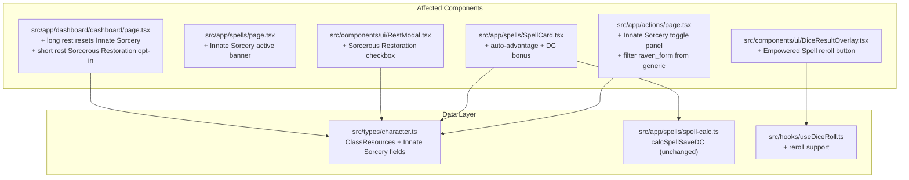

# Design Document: Madea Sorcerer Features

## Overview

This design covers four sorcerer class feature enhancements for Madea (Shadow Sorcerer 5) in the Next.js D&D Character Tracker. The changes touch the data model (`ClassResources`), three page-level components (Actions, Spells, Dashboard), two shared UI components (DiceResultOverlay, RestModal), and the dice hook.

The features are:

1. **Innate Sorcery toggle** — a new activate/deactivate panel on the Actions page (like Raven Form), costing 2 SP per activation with 2 uses/long rest, granting advantage on spell attacks and +1 spell save DC while active.
2. **Innate Sorcery spell effects** — SpellCard auto-checks advantage on spell attacks and adds +1 to displayed save DC when Innate Sorcery is active; Spells page shows an active indicator banner.
3. **Remove duplicate Raven Form** — filter `raven_form` from the generic actions list (it already has a dedicated toggle panel).
4. **Empowered Spell post-roll reroll** — after a damage roll, DiceResultOverlay shows an "Empowered Spell" button that rerolls dice at or below the die's mean, costing 1 SP.
5. **Sorcerous Restoration** — a checkbox in the Short Rest modal that recovers `floor(level/2)` SP, usable once per long rest.

All changes follow existing patterns: client-side React with `useCharacterData` for state, `useDiceRoll` for dice, pure functions in `spell-calc.ts`, and the existing toggle UI pattern from Bladesong/Raven Form.

## Architecture

The architecture remains unchanged. This design adds fields to the existing `ClassResources` interface and modifies existing components. No new modules or API routes are needed.



## Components and Interfaces

### 1. ClassResources Extension (`src/types/character.ts`)

Add three optional fields to the existing `ClassResources` interface:

```typescript
// In ClassResources interface, add:
innateSorceryActive?: boolean;
innateSorceryUsesRemaining?: number;
innateSorceryMaxUses?: number;
```

These follow the exact same pattern as `ravenFormActive` / `ravenFormUsesRemaining` / `ravenFormMaxUses`.

### 2. Innate Sorcery Toggle Panel (`src/app/actions/page.tsx`)

A new `UIPanel variant="fancy"` block, placed between the Raven Form panel and the generic actions grid. Follows the identical layout pattern as the Raven Form panel:

- Title: "Innate Sorcery"
- Uses display: `{innateSorceryUsesRemaining}/{innateSorceryMaxUses}`
- SP cost display: "2 SP per activation"
- Active/Inactive status text (emerald-400 when active)
- Activate/Deactivate button

**Activation logic** (`toggleInnateSorcery`):
- If activating: check `innateSorceryUsesRemaining >= 1` AND `currentSorceryPoints >= 2`. Decrement uses by 1, deduct 2 SP, set active to true.
- If deactivating: set active to false. No SP or uses restored.
- Button disabled when: `innateSorceryActive === false` AND (`innateSorceryUsesRemaining === 0` OR `currentSorceryPoints < 2`).

### 3. Remove Duplicate Raven Form (`src/app/actions/page.tsx`)

The existing filter line:
```typescript
const genericActions = Object.entries(data.actions).filter(
  ([key]) => key !== "second_wind" && key !== "bladesong" && key !== "raven_form"
);
```
Already filters `raven_form`. However, the character data JSON still has a `raven_form` action entry. This filter is already correct — no code change needed here. The requirement is already satisfied by the existing code.

### 4. Innate Sorcery Effects on SpellCard (`src/app/spells/SpellCard.tsx`)

Two changes inside SpellCard:

**a) Auto-advantage on spell attacks:**
When `characterData.classResources.innateSorceryActive === true` and the spell has `attackRoll: true`, force the advantage checkbox to checked. The `advantage` state initializer and the checkbox become:
- Initialize `advantage` to `cr.innateSorceryActive ?? false` (when the spell has `attackRoll`).
- When Innate Sorcery is active, the checkbox shows as checked and is visually indicated as auto-set.
- Use a `useEffect` to sync the `advantage` state when `innateSorceryActive` changes.
- When Innate Sorcery deactivates, revert advantage to false (unless manually set — tracked via a `manualAdvantage` ref).

**b) +1 DC bonus:**
When `innateSorceryActive === true` and the spell has a `saveType`, add +1 to the displayed DC value:
```typescript
const baseDC = calcSpellSaveDC(proficiencyBonus, spellcastingAbility, stats);
const displayDC = baseDC + (cr.innateSorceryActive ? 1 : 0);
```

### 5. Innate Sorcery Banner on Spells Page (`src/app/spells/page.tsx`)

A small banner below the warning area, visible only when `data.classResources.innateSorceryActive`:
```tsx
{data.classResources.innateSorceryActive && (
  <div className="rounded bg-emerald-800/40 px-4 py-2 text-center text-sm text-emerald-400">
    Innate Sorcery Active — Spell attacks have advantage, Save DC +1
  </div>
)}
```

### 6. Empowered Spell Reroll in DiceResultOverlay (`src/components/ui/DiceResultOverlay.tsx`)

The overlay needs additional props and state:

**New props:**
```typescript
interface Props {
  roll: DiceRoll;
  result: DiceResult | null;
  onDismiss: () => void;
  // New for Empowered Spell:
  characterData?: CharacterData;
  onMutate?: (partial: Partial<CharacterData>) => void;
}
```

**Reroll logic:**
- Show "Empowered Spell (1 SP)" button when:
  - `characterData` is provided (sorcerer)
  - `currentSorceryPoints >= 1`
  - The roll label indicates a damage roll (contains a damage dice expression like `Xd6` or a damage type keyword)
  - The button hasn't been used yet on this roll (tracked via local `empoweredUsed` state)
- On click:
  - Deduct 1 SP via `onMutate`
  - For each die in `result.rolls`, if the value is `<= dieSides / 2`, reroll it (generate a new random value 1..dieSides)
  - Update the displayed rolls and total
  - Set `empoweredUsed = true` to prevent reuse
- The die sides are determined from the `roll.dice` spec (all dice in a damage roll typically share the same sides).

**Determining "damage roll":**
A roll is a damage roll if its label does NOT contain "Spell Attack", "Check", "Save", or "Second Wind (heal)". Damage labels follow the pattern `"{SpellName} — {dice} {damageType}"`.

### 7. Sorcerous Restoration in RestModal (`src/components/ui/RestModal.tsx`)

**New UI element** in the short rest section:
- A checkbox labeled "Sorcerous Restoration (+{floor(level/2)} SP)" shown when:
  - `characterData.classResources.sorceryPointsMax !== undefined`
  - `characterData.classResources.sorcerousRestorationUsed !== true`
- When `sorcerousRestorationUsed === true`, show the checkbox as disabled with "(already used)" text.
- The checkbox state is passed back to the `onConfirm` callback.

**Updated `onConfirm` signature:**
```typescript
onConfirm: (hitDiceToSpend?: number, poolSelections?: PoolSelections, useSorcerousRestoration?: boolean) => void;
```

**Dashboard handler update** (`handleShortRest` in `src/app/dashboard/dashboard/page.tsx`):
The existing `handleShortRest` already applies Sorcerous Restoration unconditionally. It needs to be changed to only apply it when the `useSorcerousRestoration` parameter is `true`:
```typescript
const handleShortRest = (hitDiceToSpend?: number, poolSelections?: PoolSelections, useSorcerousRestoration?: boolean) => {
  // ... existing hit dice logic ...
  
  // Sorcerous Restoration — only when opted in
  if (useSorcerousRestoration && data.classResources.sorceryPointsMax !== undefined && !data.classResources.sorcerousRestorationUsed) {
    const restore = Math.floor(data.level / 2);
    const newSP = Math.min(
      data.classResources.sorceryPointsMax,
      (data.classResources.currentSorceryPoints ?? 0) + restore
    );
    updates.classResources = {
      ...(updates.classResources ?? data.classResources),
      currentSorceryPoints: newSP,
      sorcerousRestorationUsed: true,
    };
  }
  // ...
};
```

### 8. Long Rest Reset (`src/app/dashboard/dashboard/page.tsx`)

Add Innate Sorcery reset to the existing long rest handler, alongside the existing Raven Form and Bladesong resets:
```typescript
if (cr.innateSorceryMaxUses !== undefined) {
  cr.innateSorceryUsesRemaining = cr.innateSorceryMaxUses;
  cr.innateSorceryActive = false;
}
```

### 9. DiceResult Extension (`src/types/dice.ts`)

No changes needed to the `DiceResult` interface. The Empowered Spell reroll will use local component state in DiceResultOverlay to track the rerolled values, keeping the core dice types clean.

## Data Models

### ClassResources (updated)

```typescript
export interface ClassResources {
  // Sorcerer (Madea)
  sorceryPointsMax?: number;
  currentSorceryPoints?: number;
  ravenFormActive?: boolean;
  ravenFormUsesRemaining?: number;
  ravenFormMaxUses?: number;
  sorcerousRestorationUsed?: boolean;
  
  // NEW: Innate Sorcery
  innateSorceryActive?: boolean;          // true when the feature is toggled on
  innateSorceryUsesRemaining?: number;    // decremented on activation
  innateSorceryMaxUses?: number;          // defaults to 2 for Madea

  // Wizard/Bladesinger (Ramil) — unchanged
  bladesongActive?: boolean;
  bladesongUsesRemaining?: number;
  bladesongMaxUses?: number;
  preparedSpells?: string[];
  autoPreparedSpells?: string[];

  // Shared feat flags — unchanged
  feyBaneUsed?: boolean;
  feyMistyStepUsed?: boolean;
  druidCharmPersonUsed?: boolean;
}
```

### Character Data JSON (Madea)

The API/KV store for Madea's character needs these new fields in `classResources`:
```json
{
  "classResources": {
    "sorceryPointsMax": 5,
    "currentSorceryPoints": 5,
    "ravenFormActive": false,
    "ravenFormUsesRemaining": 1,
    "ravenFormMaxUses": 1,
    "sorcerousRestorationUsed": false,
    "innateSorceryActive": false,
    "innateSorceryUsesRemaining": 2,
    "innateSorceryMaxUses": 2
  }
}
```

### DiceRoll / DiceResult (unchanged)

No changes to the dice type interfaces. The Empowered Spell reroll is handled entirely within DiceResultOverlay's local state.


## Correctness Properties

*A property is a characteristic or behavior that should hold true across all valid executions of a system — essentially, a formal statement about what the system should do. Properties serve as the bridge between human-readable specifications and machine-verifiable correctness guarantees.*

### Property 1: Innate Sorcery activation produces correct state

*For any* ClassResources where `currentSorceryPoints >= 2` and `innateSorceryUsesRemaining >= 1` and `innateSorceryActive === false`, activating Innate Sorcery should produce a new state where `innateSorceryActive === true`, `innateSorceryUsesRemaining` is decremented by 1, and `currentSorceryPoints` is decremented by 2, with all other fields unchanged.

**Validates: Requirements 1.2**

### Property 2: Innate Sorcery deactivation preserves SP and uses

*For any* ClassResources where `innateSorceryActive === true`, deactivating Innate Sorcery should produce a new state where `innateSorceryActive === false`, and both `currentSorceryPoints` and `innateSorceryUsesRemaining` remain unchanged from the pre-deactivation values.

**Validates: Requirements 1.3**

### Property 3: Innate Sorcery activation guard

*For any* ClassResources where `innateSorceryActive === false`, the activate button should be disabled if and only if `innateSorceryUsesRemaining === 0` OR `currentSorceryPoints < 2`.

**Validates: Requirements 1.5, 1.6**

### Property 4: Innate Sorcery advantage round-trip

*For any* spell with `attackRoll === true`, when `innateSorceryActive` transitions from false to true the advantage flag should become true, and when it transitions back from true to false the advantage flag should revert to false (assuming no manual override).

**Validates: Requirements 2.1, 2.4**

### Property 5: Innate Sorcery DC bonus

*For any* proficiency bonus, CHA modifier, and spell with a `saveType`, the displayed DC when `innateSorceryActive === true` should equal `calcSpellSaveDC(proficiencyBonus, spellcastingAbility, stats) + 1`, and when `innateSorceryActive === false` it should equal the base `calcSpellSaveDC` value with no bonus.

**Validates: Requirements 2.2**

### Property 6: Long rest resets Innate Sorcery and Sorcerous Restoration

*For any* ClassResources containing Innate Sorcery fields, performing a long rest should set `innateSorceryUsesRemaining` to `innateSorceryMaxUses`, `innateSorceryActive` to false, and `sorcerousRestorationUsed` to false.

**Validates: Requirements 3.2, 6.5**

### Property 7: Generic actions exclude reserved keys

*For any* actions map containing keys from the set `{"second_wind", "bladesong", "raven_form"}`, the filtered generic actions list should contain none of those keys, and should contain all other keys from the original map.

**Validates: Requirements 4.1**

### Property 8: Empowered Spell reroll preserves high dice and rerolls low dice

*For any* array of die results and a die size, applying the Empowered Spell reroll should leave unchanged every die whose value is strictly greater than `dieSides / 2`, and should replace every die whose value is `<= dieSides / 2` with a new value in the range `[1, dieSides]`. The new total should equal the sum of all (possibly rerolled) dice plus the original modifier.

**Validates: Requirements 5.3, 5.4**

### Property 9: Empowered Spell deducts exactly 1 SP

*For any* `currentSorceryPoints >= 1`, using Empowered Spell should produce a new SP value of `currentSorceryPoints - 1`.

**Validates: Requirements 5.2**

### Property 10: Empowered Spell button visibility

*For any* DiceResultOverlay state, the Empowered Spell button should be visible and enabled if and only if: the roll is a damage roll (not an attack roll, check, or save), `currentSorceryPoints >= 1`, and Empowered Spell has not already been used on this roll.

**Validates: Requirements 5.1, 5.5, 5.6**

### Property 11: Empowered Spell single use per roll

*For any* damage roll result, after Empowered Spell has been applied once, the button should be disabled, and applying it a second time should have no effect on the dice results or sorcery points.

**Validates: Requirements 5.7**

### Property 12: Sorcerous Restoration applies correct SP recovery

*For any* character level and starting `currentSorceryPoints` and `sorceryPointsMax`, opting into Sorcerous Restoration during a short rest should add `floor(level / 2)` to `currentSorceryPoints` capped at `sorceryPointsMax`, and set `sorcerousRestorationUsed` to true.

**Validates: Requirements 6.2, 6.3**

### Property 13: Sorcerous Restoration opt-out preserves state

*For any* starting `currentSorceryPoints` and `sorcerousRestorationUsed`, confirming a short rest without the Sorcerous Restoration checkbox should leave both `currentSorceryPoints` and `sorcerousRestorationUsed` unchanged (relative to Sorcerous Restoration — other short rest effects still apply).

**Validates: Requirements 6.6**

## Error Handling

| Scenario | Handling |
|---|---|
| Activate Innate Sorcery with insufficient SP (<2) | Button is disabled; no state change occurs |
| Activate Innate Sorcery with 0 uses remaining | Button is disabled; no state change occurs |
| Empowered Spell with 0 SP | Button is disabled; no state change occurs |
| Empowered Spell clicked twice on same roll | Second click is no-op (button disabled after first use) |
| Sorcerous Restoration when already used this long rest | Checkbox is disabled; cannot be checked |
| Sorcerous Restoration would exceed SP max | SP capped at `sorceryPointsMax` |
| `innateSorceryMaxUses` undefined in ClassResources | Innate Sorcery panel not rendered (guarded by `hasInnateSorcery` check) |
| DiceResultOverlay receives no `characterData` prop | Empowered Spell button not shown (non-sorcerer characters) |

All error states are prevented at the UI level through disabled buttons and conditional rendering, matching the existing patterns used for Bladesong, Raven Form, and spell slot management.

## Testing Strategy

### Unit Tests

Unit tests should cover specific examples and edge cases:

- Innate Sorcery panel renders with correct initial state for Madea
- Innate Sorcery panel does not render for Ramil (no `innateSorceryMaxUses`)
- Raven Form action card is not in the generic actions list
- Empowered Spell button appears for a Fire Bolt damage roll but not for a spell attack roll
- Sorcerous Restoration checkbox shows "+2 SP" for level 5
- Sorcerous Restoration checkbox is disabled when `sorcerousRestorationUsed` is true
- Long rest resets all Innate Sorcery fields to defaults
- Edge case: activating Innate Sorcery with exactly 2 SP leaves 0 SP
- Edge case: Sorcerous Restoration at max SP does not exceed max
- Edge case: Empowered Spell when all dice rolled above mean — no dice change

### Property-Based Tests

Property-based tests validate universal properties across generated inputs. Use `fast-check` as the PBT library for TypeScript/React.

Each property test must:
- Run a minimum of 100 iterations
- Reference its design document property via a tag comment
- Be implemented as a single property-based test per correctness property

**Tag format:** `Feature: madea-sorcerer-features, Property {number}: {title}`

Key properties to implement as PBT:

1. **Property 1** — Generate random valid ClassResources (SP ∈ [2, max], uses ∈ [1, max]), apply activation, verify state transition.
2. **Property 2** — Generate random active ClassResources, apply deactivation, verify SP and uses unchanged.
3. **Property 3** — Generate random ClassResources with active=false, verify button disabled iff uses=0 OR SP<2.
4. **Property 5** — Generate random proficiency bonus (2-6), CHA modifier (-1 to +5), verify DC = 8 + prof + CHA + 1 when active, DC = 8 + prof + CHA when inactive.
5. **Property 7** — Generate random action maps with random keys including reserved ones, verify filter output.
6. **Property 8** — Generate random die results (1..sides) and die sizes (4,6,8,10,12), apply reroll, verify high dice unchanged and low dice in valid range.
7. **Property 9** — Generate random SP (1..max), apply Empowered Spell, verify SP decremented by exactly 1.
8. **Property 12** — Generate random level (1-20), starting SP (0..max), max SP (1-20), apply restoration, verify result = min(max, current + floor(level/2)) and used flag set.
9. **Property 13** — Generate random starting state, apply short rest without restoration, verify SP and used flag unchanged.

Properties 4, 6, 10, 11 are better suited to integration/unit tests due to their UI-stateful nature (React state transitions, component lifecycle).
