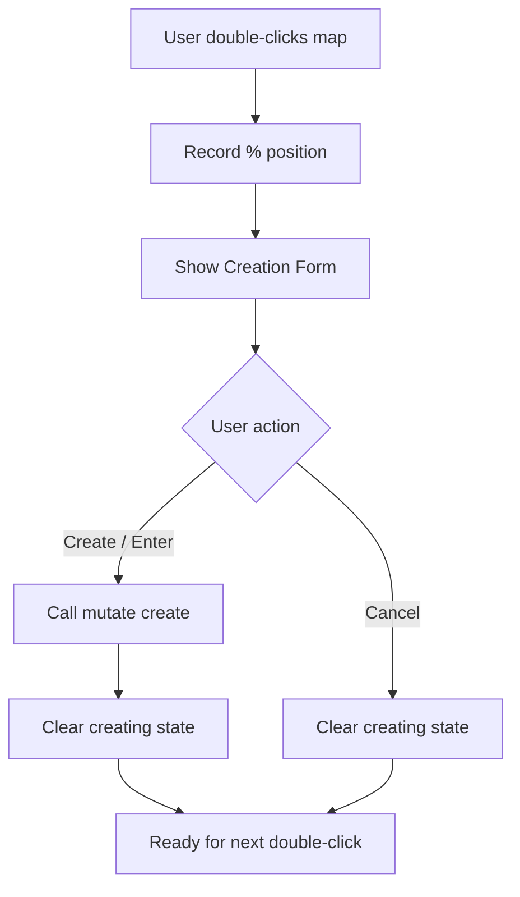

# Design Document: Map Improvements

## Overview

This design addresses four targeted improvements to the Map Viewer page (`src/src/app/map/page.tsx`):

1. Switch marker placement from single-click to double-click to prevent accidental creation during pan/zoom.
2. Apply inverse-scale transforms to marker icons so they remain a constant visual size across all zoom levels.
3. Replace the single Aetherion image with per-floor images (GF + floors 1–6) and expand the floor selector to 7 buttons.
4. Normalize the map container dimensions so Aetherion and Valerion share the same border frame size.

All changes are confined to the existing map page component and its supporting constants. No backend or API changes are required. The `useMapMarkers` hook and `MapMarker` type remain unchanged.

## Architecture

The map page is a single client component that composes:

```
MapPage (page.tsx)
├── TransformWrapper (react-zoom-pan-pinch) — zoom/pan state
│   └── TransformComponent
│       └── Map container div (ref: mapRef)
│           ├── next/image — map image (per-map, per-floor)
│           └── Marker buttons[] — positioned absolutely via % coords
├── Floor selector buttons (Aetherion only)
├── Category filter buttons
├── Marker detail panel
├── Create marker form
└── Edit marker form
```

Changes stay within this component. No new components or hooks are introduced.



## Components and Interfaces

### Modified Constants

```typescript
// Before: 5 floors
const FLOOR_LABELS = ["Ground", "1st", "2nd", "3rd", "4th"];

// After: 7 floors matching image files
const FLOOR_LABELS = ["GF", "1", "2", "3", "4", "5", "6"];
```

### New: Floor Image Mapping

```typescript
const AETHERION_FLOOR_IMAGES: Record<number, string> = {
  0: "/images/maps/aetherion/GF.png",
  1: "/images/maps/aetherion/1.png",
  2: "/images/maps/aetherion/2.png",
  3: "/images/maps/aetherion/3.png",
  4: "/images/maps/aetherion/4.png",
  5: "/images/maps/aetherion/5.png",
  6: "/images/maps/aetherion/6.png",
};
```

### New State: Zoom Scale Tracking

```typescript
const [currentScale, setCurrentScale] = useState(1);
```

Updated via `TransformWrapper`'s `onTransformed` callback:

```typescript
<TransformWrapper
  minScale={0.5}
  maxScale={4}
  initialScale={1}
  onTransformed={(_ref, state) => setCurrentScale(state.scale)}
>
```

### Event Handler Changes

| Handler | Before | After |
|---------|--------|-------|
| Map click | `onClick={handleMapClick}` | `onDoubleClick={handleMapClick}` |
| Post-create state | `creating` stays truthy until manual cancel | `setCreating(null)` called in `createMarker()` (already done, but state properly resets) |

### Marker Icon Inverse Scale

Each marker button gets an inline `transform` based on `currentScale`:

```typescript
style={{
  left: `${m.position.x}%`,
  top: `${m.position.y}%`,
  transform: `translate(-50%, -50%) scale(${1 / currentScale})`,
}}
```

The existing `-translate-x-1/2 -translate-y-1/2` Tailwind classes are replaced by the inline transform to avoid conflicts.

### Map Image Source

```typescript
// Before
const mapSrc = activeMap === "valerion"
  ? "/images/maps/Valerion_lowres.jpg"
  : "/images/maps/Atherion_map.png";

// After
const mapSrc = activeMap === "valerion"
  ? "/images/maps/Valerion_lowres.jpg"
  : AETHERION_FLOOR_IMAGES[floor];
```

### Container Sizing

Both maps use the same container approach — the `<Image>` uses `fill` layout inside a fixed-aspect-ratio container instead of explicit `width`/`height` props:

```typescript
<div ref={mapRef} className="relative cursor-crosshair aspect-[3/2]" ...>
  <Image src={mapSrc} alt={...} fill className="object-contain" priority />
  {/* markers */}
</div>
```

This ensures both Valerion (landscape) and Aetherion floor images (potentially different aspect ratios) render within the same frame without clipping.

## Data Models

No data model changes. The existing `MapMarker` interface supports floors 0–6 via the `floor?: number` field. The `useMapMarkers` hook already passes `floor` as a query parameter.

### Static Assets (New Files)

Copy from `legacy/Maps/Aetherion Maps/` to `public/images/maps/aetherion/`:

| Source | Destination |
|--------|-------------|
| `legacy/Maps/Aetherion Maps/GF.png` | `public/images/maps/aetherion/GF.png` |
| `legacy/Maps/Aetherion Maps/1.png` | `public/images/maps/aetherion/1.png` |
| `legacy/Maps/Aetherion Maps/2.png` | `public/images/maps/aetherion/2.png` |
| `legacy/Maps/Aetherion Maps/3.png` | `public/images/maps/aetherion/3.png` |
| `legacy/Maps/Aetherion Maps/4.png` | `public/images/maps/aetherion/4.png` |
| `legacy/Maps/Aetherion Maps/5.png` | `public/images/maps/aetherion/5.png` |
| `legacy/Maps/Aetherion Maps/6.png` | `public/images/maps/aetherion/6.png` |


## Correctness Properties

*A property is a characteristic or behavior that should hold true across all valid executions of a system — essentially, a formal statement about what the system should do. Properties serve as the bridge between human-readable specifications and machine-verifiable correctness guarantees.*

### Property 1: Click-to-percentage coordinate calculation

*For any* bounding rectangle with positive width and height, and any click position within that rectangle, the computed percentage coordinates `x = ((clientX - rect.left) / rect.width) * 100` and `y = ((clientY - rect.top) / rect.height) * 100` shall produce values in the range [0, 100].

**Validates: Requirements 1.1**

### Property 2: Inverse scale preserves visual marker size

*For any* zoom level between 0.5 and 4 (inclusive), applying `scale(1 / zoomLevel)` to a marker icon with a base size of 32 CSS pixels shall produce an effective on-screen size of 32 pixels (i.e., `baseSize * (1 / zoomLevel) * zoomLevel === baseSize`).

**Validates: Requirements 2.1, 2.2, 2.3**

### Property 3: Floor index to image path mapping

*For any* valid Aetherion floor index (0 through 6), the `AETHERION_FLOOR_IMAGES` mapping shall return a path matching the pattern `/images/maps/aetherion/{label}.png` where label is `"GF"` for index 0 and the string representation of the index for indices 1–6.

**Validates: Requirements 3.1, 3.3**

### Property 4: Creation state is cleared after marker creation

*For any* valid marker creation (non-empty title, valid position), after `createMarker()` completes, the `creating` state shall be `null`, allowing the user to immediately initiate a new placement.

**Validates: Requirements 1.5**

## Error Handling

These changes are purely client-side UI improvements. Error scenarios are minimal:

- **Missing floor image**: If an Aetherion floor image fails to load, Next.js `<Image>` will show its default broken-image behavior. No custom error handling needed — the images are static assets shipped with the app.
- **Invalid floor index**: The floor state is constrained by the button array (0–6). No out-of-bounds access is possible through the UI.
- **Zoom scale edge cases**: `react-zoom-pan-pinch` constrains scale to `[minScale, maxScale]` (0.5–4). Division by zero is not possible since minimum scale is 0.5.
- **Double-click during pan**: The `onDoubleClick` handler checks `if (selectedMarker || creating) return` before recording position, preventing accidental creation while a form is open.

## Testing Strategy

### Unit Tests

Focused on specific examples and edge cases:

- Verify single-click does NOT trigger marker creation (Req 1.2)
- Verify Enter key in title input triggers creation (Req 1.4)
- Verify Cancel button clears creating state (Req 1.6)
- Verify FLOOR_LABELS has exactly 7 entries with correct values (Req 3.2)
- Verify floor switch clears selectedMarker and creating state (Req 3.4)

### Property-Based Tests

Using `fast-check` (already available in the project's test ecosystem via vitest).

Each property test runs a minimum of 100 iterations.

- **Feature: map-improvements, Property 1: Click-to-percentage coordinate calculation**
  Generate random bounding rects (positive width/height) and random click positions within them. Assert computed percentages are in [0, 100].

- **Feature: map-improvements, Property 2: Inverse scale preserves visual marker size**
  Generate random zoom levels in [0.5, 4]. Assert `baseSize * (1/zoom) * zoom` equals `baseSize` (within floating-point tolerance).

- **Feature: map-improvements, Property 3: Floor index to image path mapping**
  Generate random floor indices in [0, 6]. Assert the returned path matches the expected pattern.

- **Feature: map-improvements, Property 4: Creation state is cleared after marker creation**
  Generate random valid marker data (non-empty titles, positions in [0, 100]). Assert that after calling the creation logic, the creating state is null.

Each property-based test must be tagged with a comment referencing its design property:
```
// Feature: map-improvements, Property N: <property text>
```

Each correctness property is implemented by a single property-based test.
