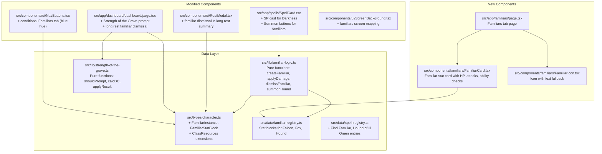

# Design Document: Shadow Sorcerer Familiars

## Overview

This design adds Shadow Sorcerer subclass abilities and a new Familiars system to the D&D Character Tracker. The feature set covers:

1. **Eyes of the Dark** — Darkness SP casting (2 SP instead of a spell slot) for Madea, with a visual indicator that she can see through the darkness.
2. **Strength of the Grave** — A CHA saving throw prompt when Madea drops to 0 HP (non-radiant, non-crit), allowing her to stay at 1 HP. Once per long rest.
3. **Hound of Ill Omen** — A 3 SP summon that creates a dire wolf familiar with its own stat block, bite attack, and special traits. Appears as a spell entry and spawns a familiar card.
4. **Familiars Tab** — A new conditional navigation tab (blue hue) that appears only when one or more familiars are active. Displays familiar cards with HP tracking, ability checks, and attacks.
5. **Find Familiar** — Free-cast spell for both characters: Falcon (Hawk stats) for Ramil, Fox (custom stats) for Madea. Normal familiars cannot attack but have ability checks and a Help action.
6. **Familiar Icons** — Each familiar card displays a recognizable icon, with text fallback.
7. **State Persistence & Rest Integration** — Familiar state persists in `CharacterData` via `useCharacterData`. Long rest dismisses all familiars and resets Strength of the Grave.

The implementation follows existing patterns: `useCharacterData` for state, `useDiceRoll` for dice, `SpellCard` for spell entries, `UIPanel` for layout, and `NavButtons` for navigation. One new page (`/familiars`) and one new component (`FamiliarCard`) are introduced.

## Architecture



## Components and Interfaces

### 1. FamiliarInstance & FamiliarStatBlock (`src/types/character.ts`)

New types added alongside existing character types:

```typescript
export interface FamiliarStatBlock {
  name: string;
  type: "beast" | "monstrosity";
  ac: number;
  maxHp: number;
  speed: string;
  abilities: Record<AbilityName, { value: number; modifier: number }>;
  passivePerception?: number;
  traits: string[];
  attacks?: {
    name: string;
    toHit: number;
    damageDice: string;
    damageType: string;
    description?: string;
  }[];
}

export interface FamiliarInstance {
  id: string;
  familiarType: "falcon" | "fox" | "hound";
  currentHp: number;
  maxHp: number;
  tempHp: number;
  summonedAt: number; // timestamp
}
```

### 2. ClassResources Extensions (`src/types/character.ts`)

```typescript
// Add to ClassResources:
strengthOfTheGraveUsed?: boolean;  // reset on long rest
familiars?: FamiliarInstance[];     // active familiar instances
```

### 3. Familiar Registry (`src/data/familiar-registry.ts`)

Static stat block definitions for each familiar type. Pure data, no logic.

```typescript
export const FAMILIAR_STAT_BLOCKS: Record<string, FamiliarStatBlock> = {
  falcon: {
    name: "Falcon",
    type: "beast",
    ac: 13,
    maxHp: 1,
    speed: "10 ft, fly 60 ft",
    abilities: {
      STR: { value: 5, modifier: -3 },
      DEX: { value: 16, modifier: 3 },
      CON: { value: 8, modifier: -1 },
      INT: { value: 2, modifier: -4 },
      WIS: { value: 14, modifier: 2 },
      CHA: { value: 6, modifier: -2 },
    },
    passivePerception: 14,
    traits: ["Keen Sight: Advantage on Perception checks relying on sight"],
  },
  fox: {
    name: "Fox",
    type: "beast",
    ac: 13,
    maxHp: 2,
    speed: "30 ft, burrow 5 ft",
    abilities: {
      STR: { value: 2, modifier: -4 },
      DEX: { value: 16, modifier: 3 },
      CON: { value: 11, modifier: 0 },
      INT: { value: 3, modifier: -4 },
      WIS: { value: 12, modifier: 1 },
      CHA: { value: 6, modifier: -2 },
    },
    passivePerception: 13,
    traits: [
      "Keen Hearing: Advantage on Perception checks relying on hearing",
      "Darkvision 60 ft",
    ],
  },
  hound: {
    name: "Hound of Ill Omen",
    type: "monstrosity",
    ac: 14,
    maxHp: 37,
    speed: "50 ft",
    abilities: {
      STR: { value: 17, modifier: 3 },
      DEX: { value: 15, modifier: 2 },
      CON: { value: 15, modifier: 2 },
      INT: { value: 3, modifier: -4 },
      WIS: { value: 12, modifier: 1 },
      CHA: { value: 7, modifier: -2 },
    },
    traits: [
      "Target has disadvantage on saves vs caster's spells while Hound is within 5 ft",
      "Can move through creatures and objects as difficult terrain",
    ],
    attacks: [
      {
        name: "Bite",
        toHit: 5,
        damageDice: "2d6+3",
        damageType: "piercing",
        description: "DC 13 STR save or knocked prone",
      },
    ],
  },
};
```

### 4. Familiar Logic (`src/lib/familiar-logic.ts`)

Pure functions for familiar state management. All functions take current state and return new state — no side effects.

```typescript
export function createFamiliar(
  type: "falcon" | "fox" | "hound",
  sorcererLevel?: number
): FamiliarInstance;

export function applyFamiliarDamage(
  familiar: FamiliarInstance,
  damage: number
): FamiliarInstance; // reduces tempHp first, then hp

export function dismissFamiliar(
  familiars: FamiliarInstance[],
  familiarId: string
): FamiliarInstance[];

export function removeDead(
  familiars: FamiliarInstance[]
): FamiliarInstance[]; // filters out hp <= 0
```

For the Hound, `createFamiliar("hound", sorcererLevel)` sets `tempHp = Math.floor(sorcererLevel / 2)`.

### 5. Strength of the Grave Logic (`src/lib/strength-of-the-grave.ts`)

Pure functions for the Strength of the Grave feature:

```typescript
export function shouldPromptStrengthOfGrave(
  currentHp: number,
  newHp: number,
  damageType: string | undefined,
  isCriticalHit: boolean,
  strengthOfTheGraveUsed: boolean
): boolean;
// Returns true when: newHp <= 0 && damageType !== "radiant" && !isCriticalHit && !strengthOfTheGraveUsed

export function calcStrengthOfGraveDC(damageTaken: number): number;
// Returns 5 + damageTaken

export function applyStrengthOfGraveResult(
  rollTotal: number,
  dc: number
): { survived: boolean; newHp: number };
// survived = rollTotal >= dc; newHp = survived ? 1 : 0
```

### 6. NavButtons Modification (`src/components/ui/NavButtons.tsx`)

The `SCREENS` array becomes dynamic. When `familiars` array is non-empty, append a "Familiars" entry with blue styling:

```typescript
// Build screens list dynamically
const screens = [...BASE_SCREENS];
if (hasFamiliars) {
  screens.push({ href: "/familiars", label: "Familiars", variant: "blue" });
}
```

NavButtons needs access to familiar state. Since it's used on every page, it will accept an optional `hasFamiliars` prop passed from each page's `useCharacterData` data:

```typescript
interface NavButtonsProps {
  hasFamiliars?: boolean;
}
```

The blue hue styling for the Familiars tab:
```
text-blue-400 hover:text-blue-300
```
When active: `bg-blue-900/30 text-blue-300`

### 7. SpellCard Modifications (`src/app/spells/SpellCard.tsx`)

Three new spell interactions handled within SpellCard:

**a) Darkness SP Cast (Madea only):**
When `spellName === "Darkness"` and character is a sorcerer, show an additional "Cast with SP (2)" button. On click: deduct 2 SP, show visual indicator "You can see through this darkness". Disabled when SP < 2.

**b) Find Familiar Summon:**
When `spellName === "Find Familiar"`, show a "Summon" button (no slot cost). On click: create the appropriate familiar instance based on character (Falcon for Ramil, Fox for Madea) and add to `familiars` array via `onMutate`.

**c) Hound of Ill Omen Summon:**
When `spellName === "Hound of Ill Omen"`, show a "Summon (3 SP)" button. On click: deduct 3 SP, create Hound familiar instance. Disabled when SP < 3.

These are handled via a new `handleSpecialCast` function within SpellCard that checks for these spell names and delegates to the appropriate logic.

### 8. FamiliarCard Component (`src/components/familiars/FamiliarCard.tsx`)

A UIPanel-based card displaying a single familiar's information:

```typescript
interface FamiliarCardProps {
  familiar: FamiliarInstance;
  statBlock: FamiliarStatBlock;
  onRollDice: (roll: DiceRoll) => void;
  onDamage: (familiarId: string, damage: number) => void;
  onDismiss: (familiarId: string) => void;
}
```

Layout:
- Header: Icon + Name + Type badge
- Stats row: HP bar (current/max + tempHp), AC, Speed
- Ability scores: 6 clickable buttons (d20 + modifier), same pattern as dashboard
- Traits: listed as text
- Attacks (Hound only): "Bite" button → rolls d20+5 via `onRollDice`, "Damage" button → rolls 2d6+3
- Normal familiars: "Help" action button (descriptive only)
- Damage input + "Damage" button to apply damage
- "Dismiss" button to remove the familiar

### 9. FamiliarsPage (`src/app/familiars/page.tsx`)

Standard page following existing patterns:

```typescript
export default function FamiliarsPage() {
  // useCharacterData, useDiceRoll, useSession — same as other pages
  // Renders: ScreenBackground, AmbientEffects, NavButtons, FamiliarCard per familiar
  // DiceResultOverlay for dice rolls
}
```

### 10. Strength of the Grave Prompt (`src/app/dashboard/dashboard/page.tsx`)

When `applyDamage` reduces HP to 0, check `shouldPromptStrengthOfGrave`. If true, show a modal/overlay with:
- DC display: "DC {5 + damage} CHA Save"
- "Roll CHA Save" button → rolls d20 + CHA modifier via `useDiceRoll`
- On result: if meets DC → set HP to 1, mark `strengthOfTheGraveUsed = true`; if fails → HP stays 0, proceed to death saves

This is implemented as a state-driven prompt (`strengthOfGravePrompt` state) that appears between damage application and the normal 0 HP death save flow.

### 11. Rest Integration

**Long Rest (`handleLongRest` in dashboard):**
- Add: `familiars: []` to dismiss all familiars
- Add: `strengthOfTheGraveUsed: false` reset in classResources

**RestModal (`buildLongRestItems`):**
- Add line items for familiar dismissal and Strength of the Grave reset

### 12. ScreenBackground Extension

Add `familiars` mapping to `SCREEN_BACKGROUNDS`:
```typescript
familiars: "spells_background.png", // reuse spells background
```

### 13. Spell Registry Additions (`src/data/spell-registry.ts`)

Add two new entries:

```typescript
"Find Familiar": {
  name: "Find Familiar",
  level: 1,
  school: "Conjuration",
  castingTime: "1 bonus action",
  range: "10 feet",
  components: { verbal: true, somatic: true, material: false },
  duration: "Instantaneous",
  description: "You summon your bonded familiar...",
},

"Hound of Ill Omen": {
  name: "Hound of Ill Omen",
  level: 0, // not a real spell level — uses SP
  school: "Necromancy",
  castingTime: "1 bonus action",
  range: "30 feet of target",
  components: { verbal: false, somatic: false, material: false },
  duration: "Until dismissed or destroyed",
  description: "You spend 3 sorcery points to summon a hound of ill omen...",
},
```

### 14. FamiliarIcon Component (`src/components/familiars/FamiliarIcon.tsx`)

Small component that renders an icon image for a familiar, with text fallback:

```typescript
interface FamiliarIconProps {
  familiarType: "falcon" | "fox" | "hound";
  size?: number;
}
```

Icon files placed in `public/images/icons/familiars/`:
- `falcon.png` — uses Find Familiar Raven icon from BG3 set
- `fox.png` — uses Find Familiar Scratch icon from BG3 set  
- `hound.png` — distinct hound icon

Falls back to a text label (`<span>` with familiar name) when image fails to load.

## Data Models

### CharacterData Extensions

```typescript
// In ClassResources, add:
strengthOfTheGraveUsed?: boolean;  // true after successful use, reset on long rest
familiars?: FamiliarInstance[];     // array of active familiar instances
```

### FamiliarInstance

```typescript
export interface FamiliarInstance {
  id: string;                              // crypto.randomUUID()
  familiarType: "falcon" | "fox" | "hound";
  currentHp: number;
  maxHp: number;
  tempHp: number;                          // Hound gets floor(sorcererLevel/2), others 0
  summonedAt: number;                      // Date.now() timestamp
}
```

### FamiliarStatBlock

```typescript
export interface FamiliarStatBlock {
  name: string;
  type: "beast" | "monstrosity";
  ac: number;
  maxHp: number;
  speed: string;
  abilities: Record<AbilityName, { value: number; modifier: number }>;
  passivePerception?: number;
  traits: string[];
  attacks?: {
    name: string;
    toHit: number;
    damageDice: string;
    damageType: string;
    description?: string;
  }[];
}
```

### Spell Registry Shape (unchanged interface, new entries)

The existing `SpellData` interface is sufficient for Find Familiar and Hound of Ill Omen. No interface changes needed.

### Character Data JSON Updates

**Madea's KV data:**
```json
{
  "classResources": {
    "strengthOfTheGraveUsed": false,
    "familiars": []
  },
  "spells": {
    "1st": ["...", "Find Familiar"],
    "3rd": ["...", "Hound of Ill Omen"]
  }
}
```

**Ramil's KV data:**
```json
{
  "classResources": {
    "familiars": []
  },
  "spells": {
    "1st": ["...", "Find Familiar"]
  }
}
```


## Correctness Properties

*A property is a characteristic or behavior that should hold true across all valid executions of a system — essentially, a formal statement about what the system should do. Properties serve as the bridge between human-readable specifications and machine-verifiable correctness guarantees.*

### Property 1: SP-cost deduction and guard

*For any* sorcery point cost (2 for Darkness, 3 for Hound) and any current sorcery points value, if current SP >= cost then the action should succeed and produce new SP = current SP - cost with spell slots unchanged; if current SP < cost then the action should be rejected and SP should remain unchanged.

**Validates: Requirements 1.2, 1.3, 3.2, 3.3**

### Property 2: Strength of the Grave prompt conditions

*For any* combination of (currentHp, damage, damageType, isCriticalHit, strengthOfTheGraveUsed), the Strength of the Grave prompt should appear if and only if: the resulting HP would be <= 0, AND damageType is not "radiant", AND isCriticalHit is false, AND strengthOfTheGraveUsed is false.

**Validates: Requirements 2.1, 2.6, 2.7**

### Property 3: Strength of the Grave save outcome

*For any* roll total and DC (where DC = 5 + damage taken), if rollTotal >= DC then the result should be survived=true with newHp=1 and strengthOfTheGraveUsed set to true; if rollTotal < DC then survived=false with newHp=0 and strengthOfTheGraveUsed unchanged.

**Validates: Requirements 2.3, 2.4, 2.5**

### Property 4: Familiar damage reduces temporary HP first

*For any* FamiliarInstance with tempHp >= 0 and currentHp >= 0, and any positive damage value, applying damage should first reduce tempHp (clamped to 0), then apply remaining damage to currentHp (clamped to 0). The total HP lost (tempHp reduction + currentHp reduction) should equal min(damage, original tempHp + original currentHp).

**Validates: Requirements 4.5**

### Property 5: Familiar removal by ID

*For any* array of FamiliarInstances and any valid familiar ID present in the array, dismissing that familiar should produce an array with length decreased by 1 that does not contain the dismissed ID, and all other familiars should remain unchanged.

**Validates: Requirements 4.6, 4.7, 6.12**

### Property 6: Familiars tab visibility

*For any* familiars array in CharacterData, the Familiars navigation tab should be visible if and only if the array has length > 0.

**Validates: Requirements 5.1, 5.2, 3.6, 6.5**

### Property 7: Hound creation with level-scaled temporary HP

*For any* sorcerer level (1-20), creating a Hound of Ill Omen should produce a FamiliarInstance with familiarType="hound", maxHp=37, currentHp=37, and tempHp=floor(sorcererLevel/2).

**Validates: Requirements 3.4**

### Property 8: Character-specific familiar type mapping

*For any* character ID, summoning via Find Familiar should create a familiar of the correct type: "falcon" for Ramil, "fox" for Madea. The created familiar's maxHp and stat block should match the corresponding registry entry.

**Validates: Requirements 6.2**

### Property 9: Normal familiars have no attacks

*For any* familiar of type "falcon" or "fox", the corresponding stat block should have no attacks defined (attacks is undefined or empty), while a familiar of type "hound" should have at least one attack.

**Validates: Requirements 6.11**

### Property 10: Long rest resets familiars and Strength of the Grave

*For any* CharacterData with a non-empty familiars array and strengthOfTheGraveUsed=true, performing a long rest should produce familiars=[] (empty array) and strengthOfTheGraveUsed=false.

**Validates: Requirements 2.8, 8.3, 8.4**

### Property 11: Dead familiar removal

*For any* array of FamiliarInstances where some have currentHp <= 0 and tempHp <= 0, removing dead familiars should produce an array containing only familiars with currentHp > 0, preserving their order and data.

**Validates: Requirements 4.6, 6.12**

### Property 12: SP cast button restricted to Darkness for sorcerers

*For any* spell name and character class, the "Cast with SP" button should be available if and only if spellName === "Darkness" AND the character is a sorcerer (has sorceryPointsMax defined).

**Validates: Requirements 1.5**

## Error Handling

| Scenario | Handling |
|---|---|
| Cast Darkness with SP when SP < 2 | Button disabled; warning "Insufficient sorcery points" |
| Summon Hound with SP < 3 | Button disabled; warning "Insufficient sorcery points" |
| Strength of the Grave on radiant damage | Prompt skipped; normal 0 HP / death save flow |
| Strength of the Grave on critical hit | Prompt skipped; normal 0 HP / death save flow |
| Strength of the Grave already used this rest | Prompt skipped; normal 0 HP / death save flow |
| Damage applied to familiar exceeds HP + tempHp | HP clamped to 0; familiar removed |
| Dismiss familiar when it's the last one | Familiar removed; Familiars tab hidden |
| Familiar icon image not found | Text fallback label with familiar name |
| Navigate to /familiars with no active familiars | Redirect to dashboard or show empty state message |
| Find Familiar when familiar of same type already exists | Replace existing familiar (dismiss old, create new) |
| Long rest with no familiars active | No familiar-related changes; other long rest logic proceeds normally |

All error states are prevented at the UI level through disabled buttons and conditional rendering, consistent with existing patterns (Bladesong, Raven Form, spell slot management).

## Testing Strategy

### Unit Tests

Unit tests cover specific examples, edge cases, and integration points:

- Darkness SpellCard renders "Cast with SP (2)" button for Madea but not for Ramil
- Find Familiar SpellCard renders "Summon" button with "Free" label
- Hound of Ill Omen SpellCard renders "Summon (3 SP)" button for Madea
- Falcon stat block has correct values (AC 13, HP 1, Keen Sight trait)
- Fox stat block has correct values (AC 13, HP 2, Keen Hearing trait, Darkvision)
- Hound stat block has Bite attack with +5 to hit and 2d6+3 damage
- FamiliarCard renders ability check buttons for all 6 abilities
- FamiliarCard renders "Help" button for normal familiars
- FamiliarCard does NOT render attack buttons for falcon/fox
- FamiliarCard renders "Bite" and "Damage" buttons for hound
- NavButtons shows Familiars tab with blue styling when familiars exist
- NavButtons hides Familiars tab when familiars array is empty
- Strength of the Grave prompt appears when HP drops to 0 from non-radiant, non-crit damage
- Strength of the Grave prompt does NOT appear for radiant damage
- Strength of the Grave prompt does NOT appear for critical hits
- Long rest handler resets strengthOfTheGraveUsed and clears familiars array
- FamiliarIcon falls back to text when image fails to load
- Edge case: damage exactly equal to tempHp leaves currentHp unchanged
- Edge case: Hound tempHp at level 1 = 0, at level 20 = 10
- Edge case: summoning familiar when one of same type already exists

### Property-Based Tests

Property-based tests validate universal properties across generated inputs. Use `fast-check` as the PBT library.

Each property test must:
- Run a minimum of 100 iterations
- Reference its design document property via a tag comment
- Be implemented as a single property-based test per correctness property

**Tag format:** `Feature: shadow-sorcerer-familiars, Property {number}: {title}`

Properties to implement as PBT:

1. **Property 1** — Generate random SP values (0-20) and costs (2, 3). Verify deduction succeeds iff SP >= cost, producing SP - cost.
2. **Property 2** — Generate random (currentHp 1-100, damage 1-200, damageType from ["fire","radiant","necrotic",...], isCrit boolean, used boolean). Verify shouldPrompt returns true iff all conditions met.
3. **Property 3** — Generate random rollTotal (1-30) and damageTaken (1-100). Verify applyStrengthOfGraveResult returns correct survived/newHp based on rollTotal vs DC.
4. **Property 4** — Generate random FamiliarInstance (tempHp 0-20, currentHp 1-50) and damage (1-100). Verify tempHp reduced first, then currentHp, total loss = min(damage, tempHp + currentHp).
5. **Property 5** — Generate random arrays of FamiliarInstances (1-5 items), pick a random ID. Verify dismissal removes exactly that ID and preserves others.
6. **Property 6** — Generate random familiars arrays (0-5 items). Verify tab visibility = (length > 0).
7. **Property 7** — Generate random sorcerer levels (1-20). Verify Hound creation produces correct tempHp = floor(level/2) and fixed stats.
8. **Property 9** — Generate random familiar types. Verify falcon/fox have no attacks, hound has attacks.
9. **Property 10** — Generate random CharacterData with familiars and strengthOfTheGraveUsed. Verify long rest produces empty familiars and used=false.
10. **Property 11** — Generate random arrays of FamiliarInstances with mixed HP values. Verify removeDead keeps only hp > 0 familiars in order.

Properties 8 (character-specific mapping) and 12 (SP button restriction) are better suited to unit tests due to the small, fixed domain of character IDs and spell names.
